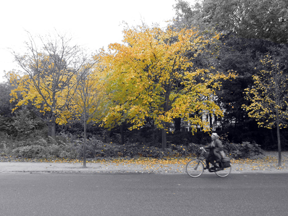

Yellow is a rare color in urban landscapes. Its only hopes are shop signs, ad posters, fancy clothes or original bikes. Autumn is the only season that concedes Yellow a moment of glory, letting it invade every tree-lined street and, above all, the city parks.