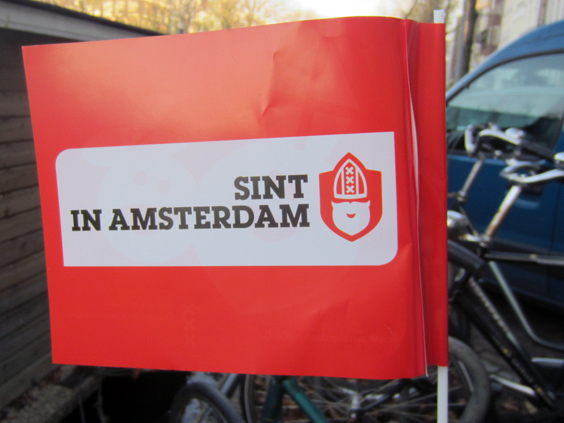
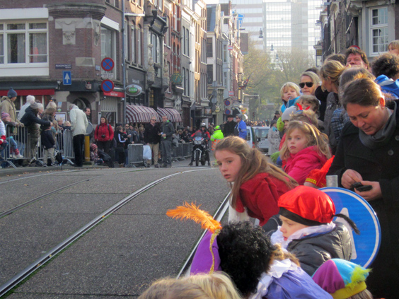
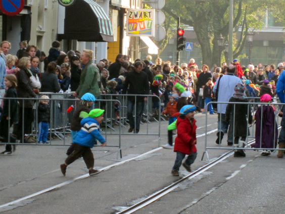
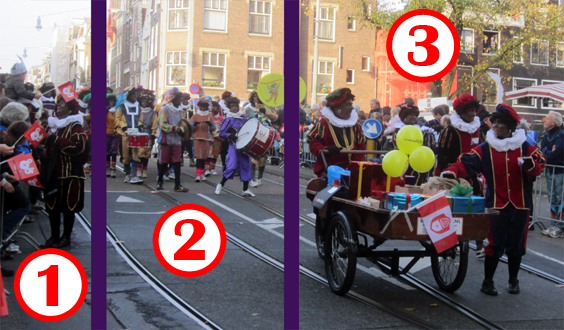
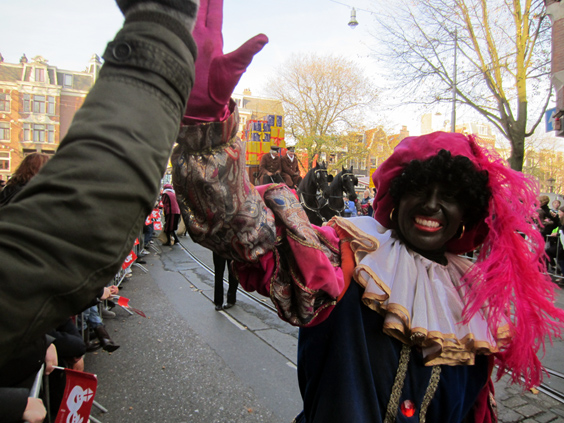

If you come from the average Western country, you probably know very well who Santa Claus is. Call him _Père Noël_, _Babbo Natale_, _Viejito Pascuero_, it's always the same laughing dude who brings presents to the kids who haven't been naughty enough over the last year.

In Holland, the true winter star has another name: Sinterklaas. 

**WHO IS SINTERKLAAS?**

He notably arrives in November on a steam boat from Spain. But the differences with Santa Claus don't stop at vehicle and land of origin. Sinterklaas adds an über-controversial side to the debate: his helper is Black Pete, or _Zwarte Piet_ in Dutch, which reminds a tad too much of the Dutch colonial past, and whose depiction is believed by many to be _profoundly_ racist.

Once off the vessel, Sint rides a white horse through the city center, where kids awaits in excitement to see the holy man and his load of gifts.

Kids are also the only ones allowed to run around in the otherwise off-limits streets!

**WHO IS ZWARTE PIET?**

Sinterklaas himself doesn't appear immediately, but it comes preceded by a legion of Black Petes. So, who are them? Their main role in the parade is to entertain people. For instance, check the foto here below.

Some Petes (numeber 1 in the pictures) walk along the fences and give treats to the bystanders-especially to the little ones, making all adults silently envious. Other Petes might play in a marching band (2), while some travel on funny vehicles full of festive boxes (3). Repeat for 1500 Petes.

Without any shadow of doubt, the Dutch colonial past is where the image of Black Pete comes from. The Petes are jolly, cheeky and behave like clowns. They are dressed in exotic clothes and have piercings, and what shocked me the most: they are a lot. Black Pete's existence in large numbers, all with the same name and "face", recalls the lack of individuality of the Negroes in the stereotype of 300 years ago.

On the other hand, Sinterklaas is rather epic and majestic. His arrival on a white horse deserves a video. Check it out and compare the Sint to the Petes that follow. (In case you don't see the embedded video here below, click [here](http://youtu.be/Fkw7LxefzEU))



The role of Black Pete is usually played by a white people painted in black, and thick red lips are added to complete the picture. 

**HOW DO THE DUTCH FEEL ABOUT THIS?**

Every country has some kind of colorful traditions, and the simple fact that they've been going on for centuries gives them a sacred aura. Judgements on it are barely allowed as any criticism is seen as an attack to one land's culture and identity--think about Spanish bullfighting. The Dutch have the same attitude with Sinterklaas. 

Every discussion about it is disdainfully dismissed with simple excuses, the most quoted being that "Black Pete is black because he comes through the chimney". Dutch people are raised with this chimney tale and apparently they see no trace of racism in it. They tend to become very defensive and upset-how do you dare accuse us of racism? 

This year, the aphex was reached in an inland town. A few people were wearing a t-shirt saying "Zwarte Piet is racist". They were accused of running an unauthorized rally (three people!) and ended up being [beaten hard by the police](http://howtogoon.com/index.php/2011/11/14/zwarte-piet-is-racisme-arrests/). A friend of mine knows one of the guys, you can trust me that this story is very real.

**WHAT IS MY TAKE?**

I trust my Dutch friends when they deny any racism in their thinking. What needs to be separated here is the _message_. In a modern, multi-cultural society, An epic white horserider that looks like [Gandalf](http://www.tattoodonkey.com/pics/-/w/-way-gandalf-returns-with-a-sword-upon-white-horse-is-easy-to-link-b-o-tattoodonkey.com.jpg), surrounded by a sworn of black people acting like apes in a zoo is a shockingly bad message. It is a painful reminder of a colonial and slavish past.

I believe Dutch society should be able to put that in perspective and try to go past it. To their credit, some goofy attempts have already been made: a few years back, the Black Petes shifted to politically correct colors, like blue. It ended up freaking all kids out, so black came back.

Let's try to find something positive. Luckily, this parade only happens once a year, and all things considered the Black Petes are not evil charachters but rather cute in the way they behave, so one might imagine that it could somehow hinder the vision "black = different = bad". Unfortunately, I suspect it might travel deeply in the subconscious where it might also trigger some sort of  superiority complex.

If you're interested, one article provides a [deeper and historical analysis of Zwarte Piet](http://www.humanityinaction.org/knowledgebase/255-black-pete-analyzing-a-racialized-dutch-tradition-through-the-history-of-western-creations-of-stereotypes-of-black-peoples), linking puntually the tradition to what the world looked like 300 years ago. Maybe in a few more years there'll be no more Black Petes.

