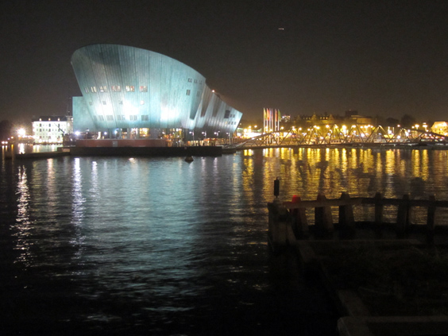

Of all Amsterdam's famous landmarks, I never managed to like the green NEMO. I know, Renzo Piano designed it. I know, it hosts an important Science Center for kids. I even ran under it for the Dam tot Damloop, a charity run: still, I can't like it. That's why, the day that I spotted its boat-like shape in a prettier view, I had to promptly capture it. Just in case.