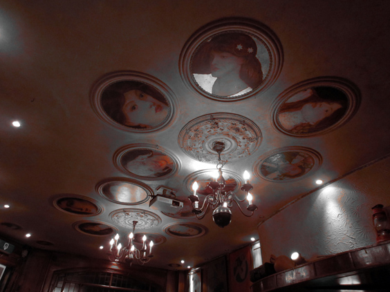

The upper walls of San Paolo Cathedral in Rome has round bas-reliefs of all the popes that ever lived. This bar along Prinsengracht in Amsterdam has round portraits of women that I wouldn't be surprised to learn being classy prostitutes of vicious, forgotten times.