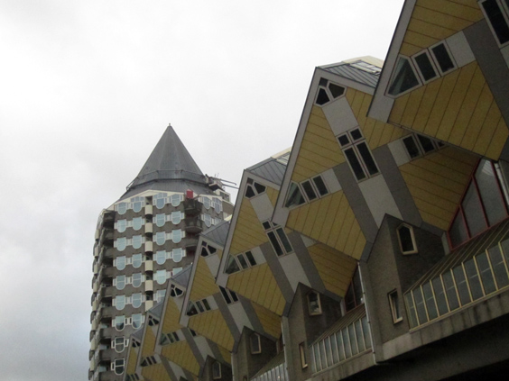
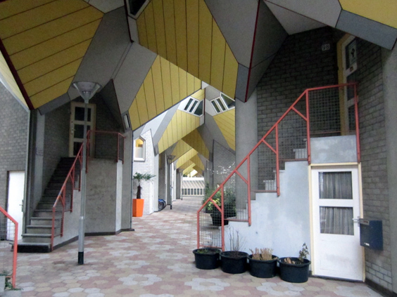
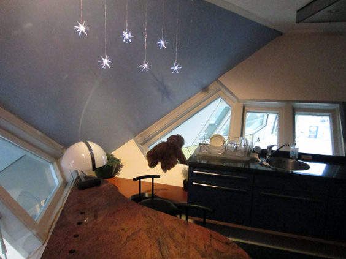
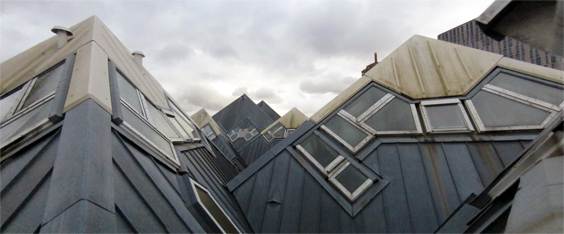
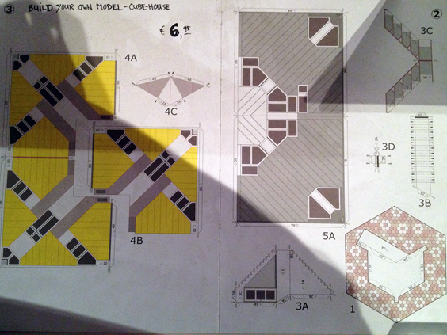

Houses come in all forms and shape, nowadays. In Holland, we have the privilege of living close to one of the strangest examples: the Cubic Houses of Rotterdam.

What makes these cubes standing out from the other [weird houses of the world](http://www.oddee.com/item_96556.aspx) is that the Cubic Houses are not the result of a past-time activity of some lonesome guy who wanted a house that looks like something, but a complex housing architectural project.

The cubes are overlooked by a pencil-shaped skyscraper, as you can see from the picture above. A busy road runs below the complex, and you need to climb some stairs to access the internal courtyard. Once there you can see how the houses are connected to each other and how to enter them.

There are 40 cubes in total, each standing on a massive pillar. Walking around that courtyard feels really strange. At first glance, it looks a bit unsecure. The angles are all different, and looking at the oblique walls while moving gives a sense of precariousness. You begin to wonder what it must be to live inside one of those and how to arrange forniture. Fortunately, all of your questions can be answered by entering the Cubic House Museum. Annoyed by the constant walking around of tourists, an owner made his house into a museum and lets you visit it for very cheap (2,50 euros at the moment of writing). 

This one above is the kitchen corner (literally!). I guess it takes some effort to organise your house around the central staircase that goes through all the floors, but all in all it didn't seem to be an impossible task. What struck me though are the walls themselves. There are no vertical outer walls, which means that hanging stuff there becomes practically impossible. Furthermore, the windows are all skewed. Light only comes from below (in the lower floors) or from above (in the upper floors).

The pointy top floor was arranged as a sort of little garden. I managed to open a window (which was actually the same brand that I have on my inclined wall at home!), and take a panorama of the view on the other "roofs". Quite unique, isn't it?

I'm not sure if I would like to live in one of those. It must be a furnishing challenge. Plus, when we laid down on the bed, all that spikiness and pointiness around didn't create a relaxing ambience at all. Maybe it's just a matter of getting used to.

As a final funny note, you can buy a cardbord card to build your own cubic house model. Go for it and you'll have a new pointy ornament for your regular, boring square house!

_This post was made possible by the generosity of FlightCentre: Hawaii flights_