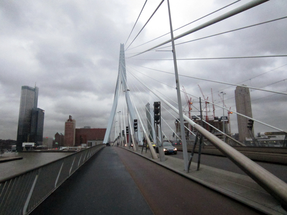

The Erasmus Bridge was completed in 1996. It is nowadays one of the symbols of Rotterdam, or better of its renaissance after the city was [flattened by the Nazis](http://www.scientificpsychic.com/etc/jeff/Jeff-Noordermeer-Rotterdam001.html) during World War II. The asymmetric bridge is the biggest of its kind in Europe and when looked at from the dock it blends almost seamlessly with the other sails.