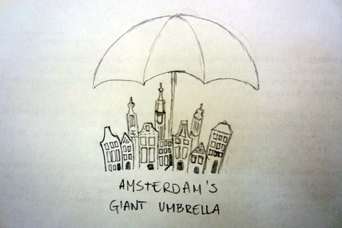
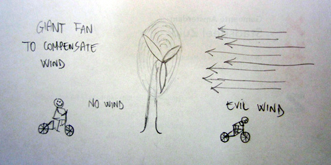
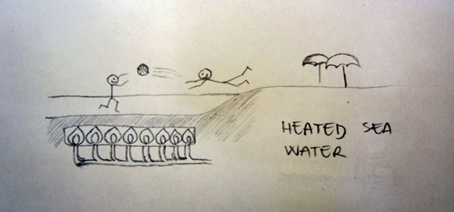
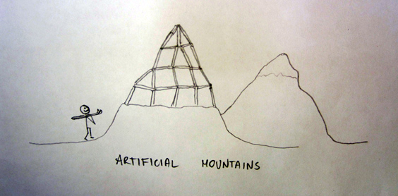

A while ago, fellow blogger Stuart launched its [domination plan upon the Netherlands](http://www.invadingholland.com/?p=3102). (This link I just wrote might help him come up in Google side by side with medieval Spaniards or, in more recent times, the Nazis). Stuart is the new leader of the country, and I have been appointed Minister of Environment!

I have drafted down a few reforms and technological introductions for this country. All of them are already being studied by the finest minds of the country. We'll soon proceed to the implementation. Here's a few of them.

**THE GIANT UMBRELLA OVER CITIES**

It rains too often in the Netherlands. Cycling in the rain is not what you hope for as you wake up. While rain is good for crops and farming, city dwellers don't need it--and Vondelpark can be artificially irrigated. That's why a giant umbrella will open and protect everyone in town, from the businessman to the squatter.

**THE REVERSE WIND FARM**

We all know who is rain's best friend: the wind. The Netherlands has a prominent set of [offshore wind farms](http://www.rnw.nl/english/article/record-breaking-wind-farms-run-subsidies) to produce electric energy. Now it's time to build some even bigger fan to please people. Huge fans with swivel bases will precisely compensate the wind. Cycling will be a lot easier, at least on one side of the fan.

**HEATED SEA WATER**

We all love going to the beach. Even here in the Netherlands, the perfect conditions occasionally arise. Sunny and warm, you lay sunbathing just like a lizard would do. All is great... until the moment you decide to go for a swim. The water is as icy as a Martini coctkail, and within two minutes your feet begin aching. With my change, the first 20 meters off the shore will be heated up to the perfect temperature. The Mediterrean won't seem far anymore.

**ARTIFICIAL MOUNTAINS**

Paragliding fans have never really felt home in Holland. Skiers and snowboarders realized that the descending slope of a bicycle bridge isn't long nor steep enough to be fun. That's why my architects are already planning the first artificial mountains of the country. Someone had proposed [the same idea](http://www.dailymail.co.uk/news/article-2032230/Mountain-Holland-Engineers-brainstorm-ideas-jokey-request-journalist.html) in the past, but this time is for real. No plane tickets to the Alps will be sold for wintersport 2013!

