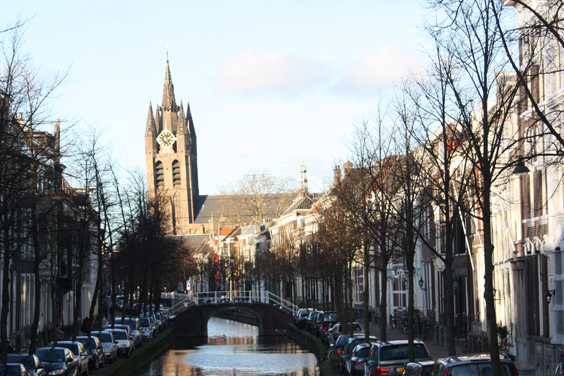
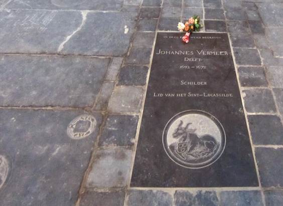
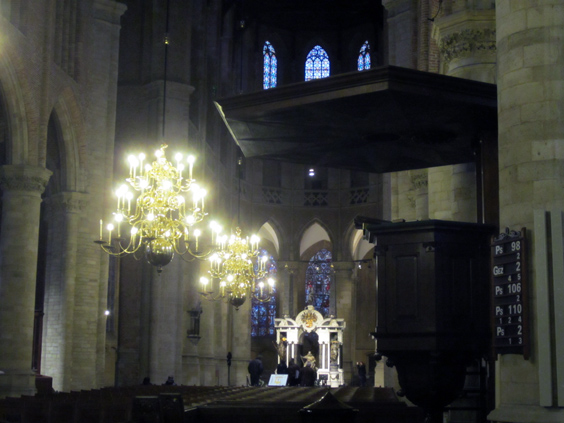
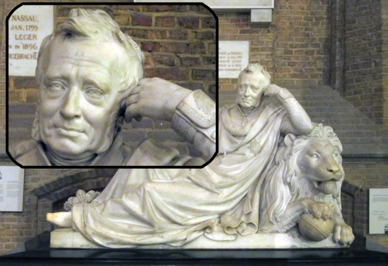
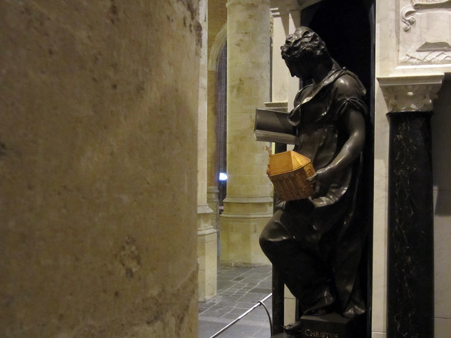

Which is the most famous leaning structure of the world? It's probably [this one](http://thingsiwanttoeat.tumblr.com/post/121087951/mega-hamburger-four-the-leaning-tower-of-bacon). In Holland there is another such structure, way less famous but nonetheless worth a post: the Leaning Church of Delft. Also knowns as _Oude Kerk_ ("Old Church"). Actually, only the bell tower is actually leaning. But calling it the "Leaning Church" marks the distinction from another [incredible structure you might have heard about](http://science.howstuffworks.com/engineering/structural/will-leaning-tower-of-pisa-fall.htm).

The tower tip is two meters skewed from the vertical. The reason is not to be found in any earthquake or natural disaster: simply enough, the foundations were not strong enough and the tower began to lean from the very beginning. Instead of doing a complete rework, they tried to compensate its lean on each layer of the tower as they continued to build. With little success, obviously.

The most famous content of the tower is the tomb of Dutch painter [Johannes Vermeer](http://www.johannesvermeer.org/). Think about the [_Girl with a pearl earring_](http://en.wikipedia.org/wiki/Girl_with_a_Pearl_Earring). The master rests in peace, and it must feel good to be in the only one tomb that nobody steps on.

Let's take now a few steps out and move to another church: the _Niewue Kerk_ ("New Church"). The interior is just as cool, but it's not leaning anywhere, thus not deserving an entire post.

A cool feature of the church are its mushroom-like pulpits. We concluded that the huge cover must have been built like that to deflect the voice of the preacher right onto the poor penintents. iPulpit, we could say.

This church also hosts a lot of cool stuff. For instance a great statue of (big breath) Willem George Frederik, prince of Oranje en Nassau. I wonder if they had to extend one wall in order to make room for the dude's name. Anyway, he basically spent his adolthood fighting battles all over Europe, until his death in Italy in 1799. The statue's facial expression of resigned regret  strucked me. It seems to ask the onlookers, _"was it really worth spending a life fighting like a puppet?"_

The best tomb of them all is the one where William the Silent rests. His real name is _Willem van Oranje_, and he was the main leader of the Dutch independence revolt against the Spanish in 1568, which lead to the birth of the Netherlands as we know it today. He is the founder of the current royal dynasty. His tomb is indeed [majestic](http://www.flickr.com/photos/twiga_swala/2302459421/) and adorned with four statues that represent Justice, Prudence, Religion, and Liberty. The religious one holds a model of the church itself. Lego wasn't too far from rising!

_This post was made possible by the generosity of Beat The Brochure: cheap holidays_