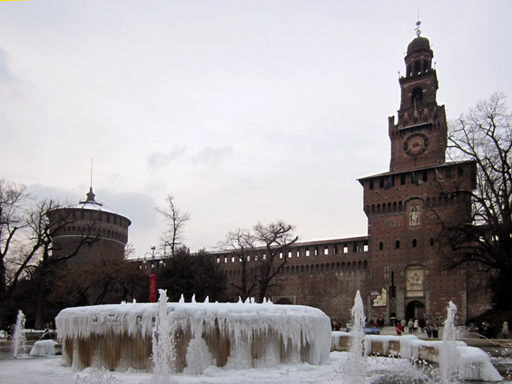
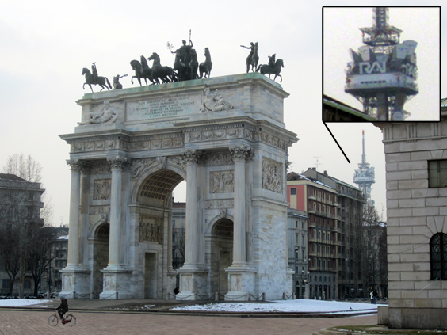
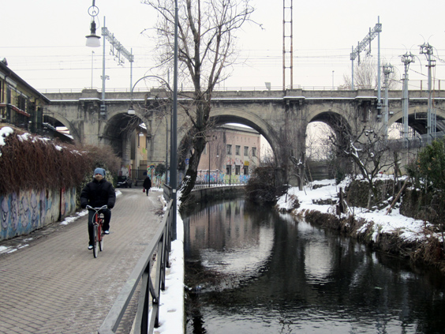
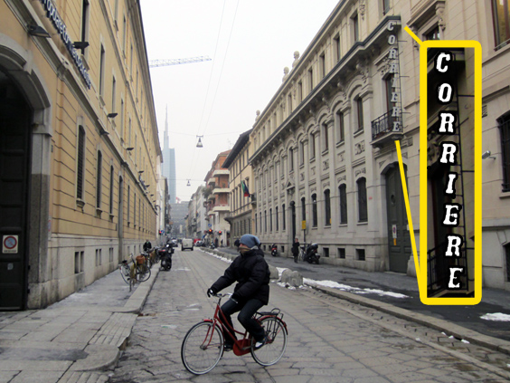
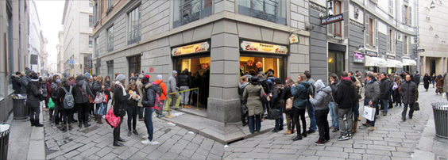

Do you all know where I am from? I bet you do. In case you don't though, my blood is Italian: born and raised there. More specifically, I come from Rome. There's something unique about Rome, something special, something that you can't describe but which makes you fall in love with it.

Just as the two Dutch "defining cities" are Amsterdam and Rotterdam, with their love-hate relationship, Italy's other side of the coin is Milan. People in either town naturally grow up with some kind of negative prejudice about the other one, and I'm no exception to it.

For the first time in my life, I spent a weekend there visiting a friend. I had the opportunity to be a tourist in Milan and find out more about its secrets.

<!--more-->

The castle you see above belonged to the Sforza family, a very prominent one that fought a lot for the powerful ones, like the pope for instance. It's quite big and dramatic.. especially covered in snow!

Not to be second to Rome and Paris, Milan has a massive arch as well. Like the other two, it echoes times of wars and empires, but at least this one is named 'Arch of Peace'. What I thought was funny about is that the TV antennas appear next to it. They are the most effective modern weapon I can think of. 

After such similarity with Rome and Paris, Milan was even able to remind me of Amsterdam: it has a series of canals that you can't miss. They're called _Navigli_ (vessels), but they're not as charming as the canals in Amsterdam.

While cycling home, we incidentally passed by _Via Solferino_ (Solferino street). For my Italian readers, that's where the important newspaper _Corriere della Sera_ has its historical headquarter. I couldn't miss a picture with it.

One of the town's landmarks is the _Duomo_, Milan's cathedral and the fourth largest in the world. With all those spires, it is definitely an impressive sight. The interior is just as interesting, and I'll dedicate an entire post to it.

Steps away from the Duomo, there's an (almost equally) famous place. A shop that makes _panzerotti_, a sort of mini-calzone that come with different fillings. Delicious. There was a huge double line coming out of each door of the shop!

So what is my take on Milan after being a proper tourist there? Check back for the second part of this Milan series and you'll know!
