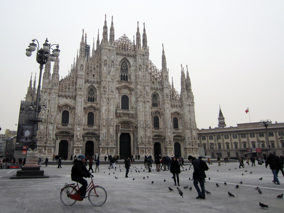
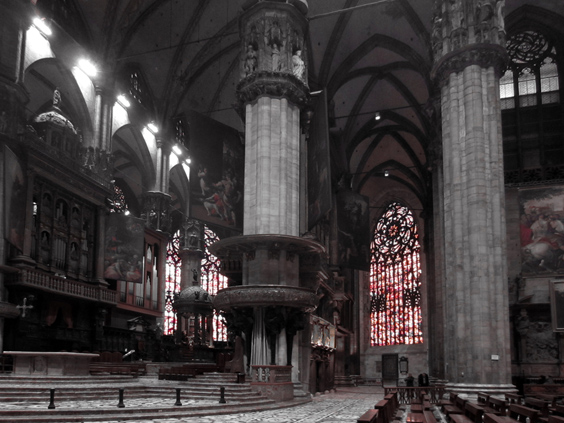
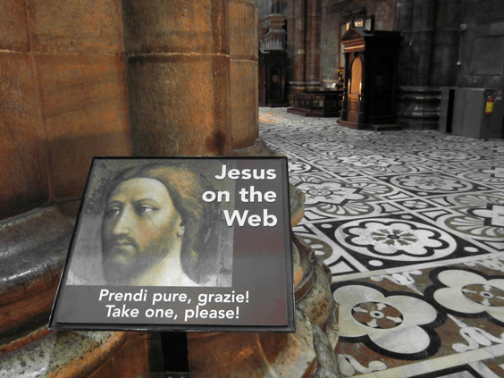
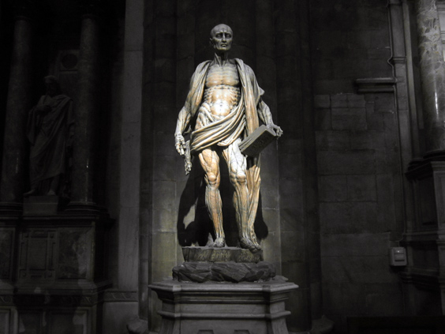

Welcome to the second part of my attempt to become a bit more aware of what Milan has to offer! In the first part I talked about various city attractions, but I left out the most important one: this time we'll look specifically at its fabulous cathedral, or _Duomo_. Again on a bike, of course.

The church is situated in the most central spot in town, around which everything grew. Its spiers are deservedly world-famous, and the statue of the Virgin Mary of top of it (which is unfortunately not visible in the picture) as arisen as one of the symbols of the city.

The interiors are just as epic as the outside, with massive colums and spectacular windows.

Also, the building serves as a WiFi Hotspot for the most celebrated figures of catholicism. It should never be said that the Church is behind the times.

Another thing that struck me inside is this totally unexpected statue. Maybe it's the legacy of some medical studies of the past? I couldn't say and there was no information available. Luckily I'm no eight anymore or I would have had nightmares.

Alright, time for some conclusion about this town. Was it able to wipe out my thirty-year prejudice? I still have mixed feelings. It definitely has some good sides to it. Compared to the average Italian big city, Milan is less chaotic and public transportation seems to work much better. There is abundance of jobs, and the food is good; but for the rest? The people didn't impress me. A lot of big cars and expensive shops, but what's the deep-down core? Beside the few attractions that I named in this article and the previous one, I can't imagine any reason why a tourist would want to spend more than one night here. Funnily enough though, I met a Dutch girl on the plane who loves it and regularly spends there a few weeks per year. She is a fashion designer. Definitely not the side of the world that attracts me the most.

_EDIT 2019: I spent a few months in Milan and I love it. Not as a tourist but it certainly is the most European city in Italy. I love it and I would definitely move there shall I eventually go back to Italy._

