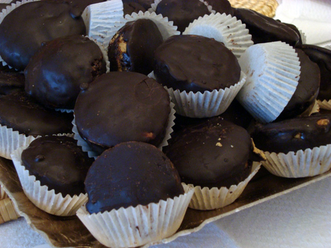
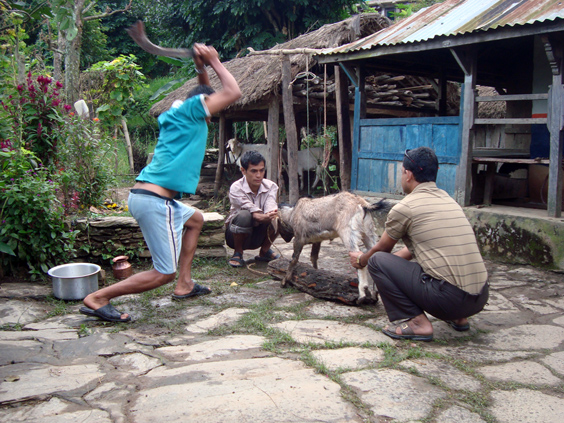
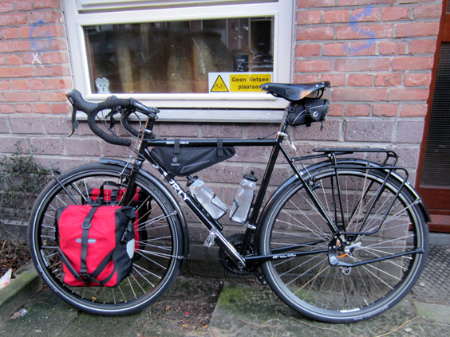
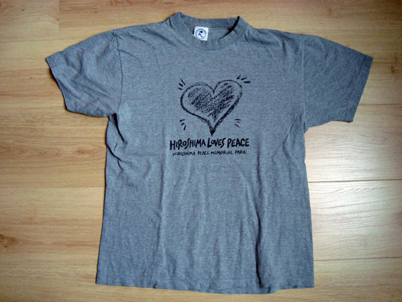
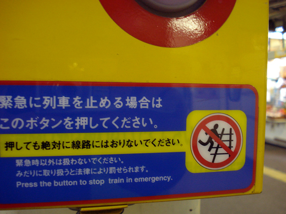
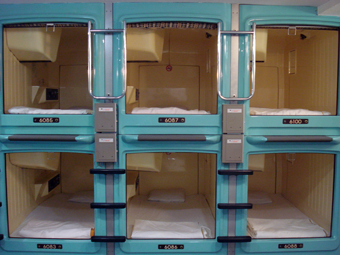
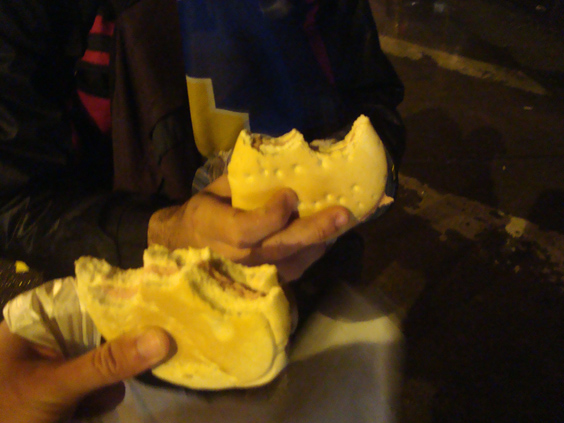
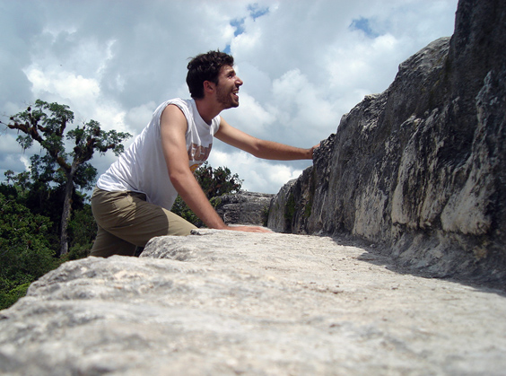
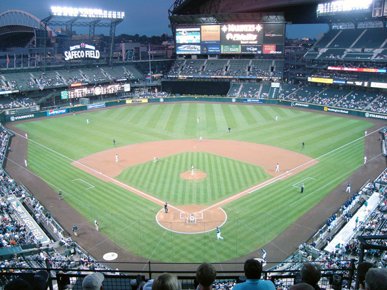

Lately, this sort of questionnaire is popular among travel blogs: a Travel ABC, where a travel-related question is asked for each letter of the alphabet. I've been nominated by my fellow blogger Stephen at [Monk Bought Lunch](http://www.monkboughtlunch.com/), so here's my go at it!

**A: Age you went on your first international trip**

The very, very first time, was to Chamonix, France, with my parents, when I was about 10. It was actually only a few hours as we were spending a week holiday on the Alps in the north-western region of Italy, Valle d'Aosta. The indelible memory of those few hours (and also the only one) is my father speaking French to someone from the car window.

**B: Best (foreign) beer you’ve had and where**

Beers are really pretty bad where I come from, so this leaves me plenty of choice abroad. One of the nicest beers I have ever tried is a Belgian beer called "Zinne Bier". It has some very unique taste to it, it's not too heavy and, cherry on the cake, "Zinne" means "boobs" in Italian.

**C: Cuisine (favorite)**

(Bias alert!) Is there another possible answer to this question than Italian? Too often, Italian cuisine is very badly represented abroad. I regularly stumble across stuff I have never heard of back in my home country, or recipes that are too much adapted to the local taste. Italian cuisine is much, much beyond what everyone thinks it is. Any town, any little village has its own thing, delicious in a different way than anywhere else in the country. Oh God, don't even get me started. (Bias alert finished.)

**D: Destinations, favorite, least favorite and why**

Hmmm, what a tough question--and we're only at "D"! I think everyone's favorite destination depends on his own attitude rather than some objective "travel" features that such place satisfies. 

For me, it would be France. I don't happen to go there very often, but everytime it's an unique feeling, maybe also because I lived there for a while. It's got it all: food, people, atmosphere, museums, incredible nature, sea... you can't possibly go wrong there (with the notable exception of Paris, where a lot can go wrong).

Least favorite: it will feel too obvious, but it would be Agra in India. I will never set foot there again. The most overcrowded tourist attraction in the most overcrowded country on Earth. We all know the feeling of being seen as a walking wallet and how annoying it can be. There, it reaches an unparalleled peak which will make you want to go into hermitage. Plus, the Taj Mahal is honestly not impressive at all for someone (bias alert!) grown up next to the Coliseum (bias alert ended).

**E: Event you experienced abroad that made you say “wow”**

There's 'wow' and 'wow'. The one that I most clearly remember happened during the Dashain festival in Nepal. The Hindu communities sacrifice animals to the good gods. I attended the beheading of a goat in a far, far away village tucked in between jungle and rice fields. I'd never seen the actual killing of an animal. Not by beheading for sure. Definitely a 'wow' moment. Followed by some fifteen minutes without being able to speak.

**F: Favorite mode of transportation**

Bicycle. The bicycle is for me the perfect pace to explore the world. It is faster than walking but it isn't as fast and dangerous as a car or a motorbike, which means that it still leaves you some attention for the world around you. Bicycle touring, be that for a day or weeks or year, is fabulous per-se. The feeling of discovery is unbeatable.

**G: Greatest feeling while traveling**

The learning feeling. Seeing things that you know you'll carry with you forever. It's the feeling that you're shaping the rest of your life with something new that will help you through the maze. It can also be challenging: it's up to you to make the most of what you've learned. So most of the times the question that pops to my mind is "will I be able to apply this teaching in my future behavior and choices?"

**H: Hottest place you’ve traveled to**

New Delhi, India. Instead of leaving the airport it felt like entering a steam sauna. Previously, the record was held by Sevilla, Spain.

**I: Incredible hospitality you’ve experienced and where**

On my way to Japan, I had met a family on the plane, mother and daughter. They were flying back home from a two weeks European tour (...). We exchanged emails and, when almost a month later I went to their city, I stayed at their place. The mum cooked one of the most incredible meals I've ever had. At the end of the meals I asked "Do you have such magnificent meals every weekend?" - "Oh no, only when dad comes home". I later found out that dad worked in Tokyo and came home twice a year.
They then took me to their local shrine and to their local hot spring. That's the only one time in my life that I actually felt overwhelmed with hospitality. I couldn't get out of my head the thought that I would be never able to reciprocate to such extent in an entire lifetime.

**J: Journey that took the longest**

Probably the train journey from Brussels, Belgium, to Rome, Italy. First, a night ride to Nice, France. Then train to Monaco and bus over the border, then some more waiting for another train and then more connections... we left at 11 pm of the 23rd of August and we arrived at 1 am on the 25th. And, believe it or not, the 24th was my birthday!

**K: Keepsake from your travels**

T-shirts! I like to have one t-shirt for each place where I've been. In practice, that is not always feasible - they're relatively heavy and take space. Also, sometimes I have bought t-shirts for the sake of it and found out later that I didn't really fancy them!

**L: Let-down sight, why and where**

The famous Harbor Bridge in Sydney. After so much anticipation, you get there and it's just a bridge. To this day I really don't understand what makes it any different than other bridges. (Not to mention the crazy waste of money of climbing it with a full harness.)

**M: Moment where you fell in love with travel**

I was 17 and with one of my best friends we enjoyed a summer school in Ireland to learn English--whose results you can judge even as you read--and we took a weekend trip to the Aran Islands. They are the "last stop" to America, right in the Atlantic ocean. We rented out bicycles and found a bed and breakfast. We went out at night, we arranged it all by ourselves and risked being trapped on the island due to bad weather. It was the unrepeatable first time that I enjoyed such freedom.

**N: Nicest hotel you’ve stayed in**

I haven't stayed in many hotels at all, so the choice is easy. It was one hotel in Mexico City, the "Brazilian" I think it was called. Next to the North Train Station, was really cheap and relatively luxurious. 

**O: Obsession—what are you obsessed with taking pictures of while traveling?**

Funny signs. Very often, nothing characterize a place better than its signs. Think about the "Forbidden to smoke weed here" sign in the Netherlands.	Or the (sad) sign to remind people not to jump on the train tracks in Japan!

**P: Passport stamps, how many and from where?**

Uh, not really many, but I'm clearly disadvantaged in this! Being Italian, I don't need a stamp as I travel to the countries that are the easiest to reach for me, that is my European neighbors. If I had a stamp for every time I crossed some European border, I would be using my third passport by now!

**Q: Quirkiest attraction you’ve visited and where**

Hmmm.. I can't think of anything properly quirky. But for sure the [Rietveld-Schroeder House](http://www.sightseeingart.net/2010/06/rietveld-schroder-house.html) in Utrecht, Holland, deserves a mention. The only one house ever built according to the famous (?) [De Stijl](http://en.wikipedia.org/wiki/De_Stijl) architecture style. Its straight lines and cubical character will make you wonder why would you live in such a house.

**R: Recommended sight, event or experience**

I would recommend anyone to sleep in a Capsule Hotel in Japan. All you get is a sort of plastic coffin where to sleep in. Porn is optional (and costs extra bucks). It is really an incredible experience that only Japanese people could have ever imagine, out of the need for accomodating men that are simply too wasted to go back home by train.

**S: Splurge; something you have no problem forking over money for while traveling**

Faster transportation. I know this doesn't sound like the average poor backpacker, but time is undeniably the most precious good we're given. If I'm not interested in what sits in between two places, I'll just hop on the quickest way to get to my next destination-usually a plane.

**T: Touristy thing you’ve done**

I once deliberately tried a proper "holiday". As in, one where everything is included: hotels, food, transportation, guide. I had to get to know the thing, to be able to say I tried it at least once. The land of the deal was Turkey. We ended up visiting a "carpet center" which turned out to be a selling trap where women worked in semi-slavery conditions. All in all it was a horrible experience, I even got food poisoning. At least I've seen cool places.

**U: Unforgettable travel memory?**

Patagonia, Chile. Travelling back from Argentina, we had to make our way to the airport during one of the most intense strikes that the region has ever experienced. It was pitch black, every road was blocked, the airport was 28 kilometers away and it was pouring down. It was an incredible adventure of walking and hitchhiking between one barricade and another. At the end of a ride on the back of a little truck, the guy spontaneously gave us bread, coldcuts and yoghurt. Somehow they knew that it would have been our only food for that night.

**V: Visas, how many and for where?**

Hmmm, maybe just two: Indian and Nepalese. Everywhere else I got by with the regular tourist stay allowance. And again, in all other European I have exactly the same rights as a local, which means I can stay indefinitely, find a job and such. That's pretty cool, I reckon!

**W: Wine, best glass of wine while traveling and where?**

No doubts in Chile: my friend Josué works at the irst biological winery of Chile. Born as a spin off of the more famous Concha y Toro, they produce some varieties of wine that are absolutely unique in the world. Right between Santiago and Valparaiso, it's not to be missed in case you are out there!

**X: eXcellent view and from where?**

From the very top of an ancient pyramid in Tikal, Guatemala. I had climbed it all by myself, on those super-high steps. Once on top, I could see the other pyramids coming out of the mighty jungle, just like mine. The far away screams of the monkeys blended with my hard breathing. I never had such feeling again thereafter. 

**Y: Years spent traveling?**

This question is surprisingly tough to answer, as it depends on the meaning we give to words. If 'travelling' = being abroad, and 'abroad' is anywhere out of your home country, I've been travelling for some 7 years in total. Four and a half of these would be living and working in the Netherlands. If those are not to be included, the counts goes down to around 30 months.

**Z: Zealous sports fans and where?**

2006 was not a good year for the Seattle Mariners. I happened to be there and went to a game with my friends, against the Oakland Athletics. Nobody was really believing in a victory, but everybody wholeheartedly supportedly nonetheless. And then... the miracle happened! Thanks to the outstanding player [Ichiro Suzuki](http://en.wikipedia.org/wiki/Ichiro_Suzuki), the Mariners showed who was in charge and ultimately won the game! It was an epic night which I will never forget. Here's a shot from shortly before the miracle happened.

