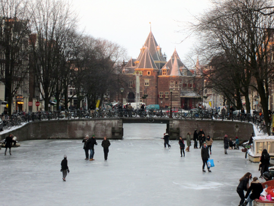
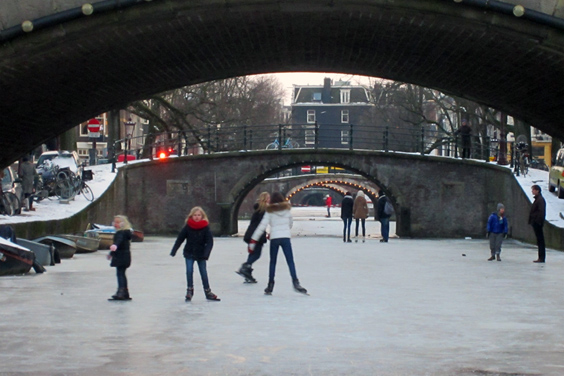
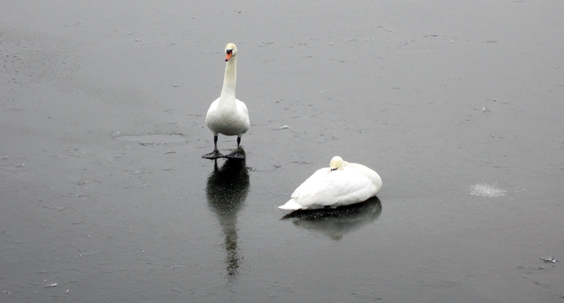
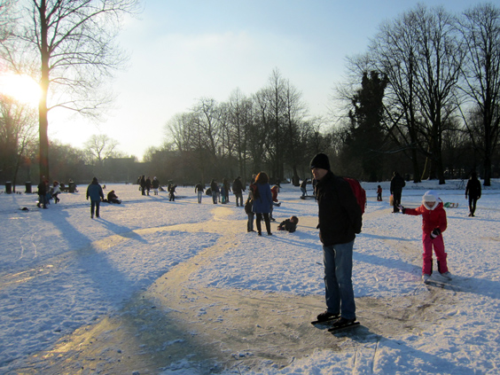

Winter is gone--long life to the winter! Spring is here and we're all happy about it, and maybe this makes an excellent moment to think back for one second the the historical past winter. Just like I did with the mist, this time around I'll look at all the ice we had.
Temperature reached a rare low. Amsterdam enjoyed the coldest night of the last 75 years (-22 celsius degrees!) and all the exposed water froze into thick skating ways. Despite the cold, it was so special that everyone skated, walked or some even cycled on the canals. It was really epic.

On our stroll on _Keisersgracht_ we talked to an blissful old man who lives right there: he told us that only twice he had seen anything like that before. Kids were obviously enjoying it the most, and the <a href="">[Seven Bridges](http://hpals.blogspot.com/2009/08/seven-bridges.html)</a> of Reguliersgracht seemed the perfect spot.

Geese enjoyed a skate too!

For a moving impression of how busy the canals were, check out this <a href="">[icy video](http://www.youtube.com/watch?v=fbfon6IhJk0)</a> from my friend <a href="">[Amstersam](http://www.amstersam.com/main.html)</a>.

And actually, there were not only canals! The park closest to my place is _Oosterpark_. Its lakes and water streams were also completely frozen. To add to the magic, it had also heavily snowed on top of it, making the frozen lake and the surrounding soil blend seamlessly into each other--hadn't you known where the lake was, you wouldn't have found it! 

_EDIT 2019: My linked friend Amstersam passed away a few years ago. Rest in peace Sam._