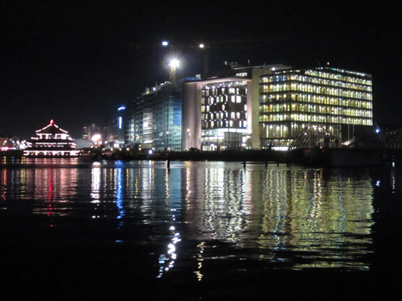

I know it's hard to believe, but all the buildings in the picture stand on an artificial island. The rightmost one is Amsterdam's conservatory, next to it the public library. The others are still under construction, except the leftmost one which is a hotel with a poshy roof bar. The sort of red Christmas tree on the left is actually a floating Chinese restaurant where a few friends got food poisoned once. 