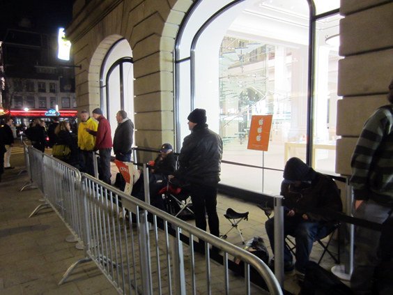
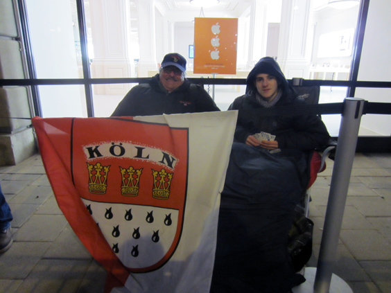
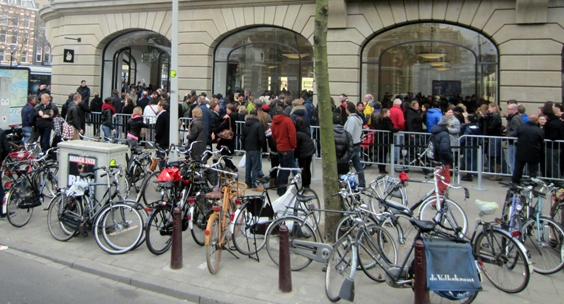
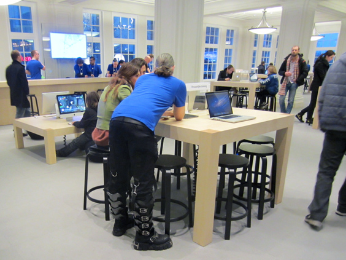
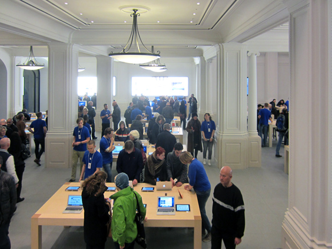

Churches in Holland are all quite empty. It doesn't matter which religion they cater: many Dutchies have been smart enough to get past those fairy tales. Unfortunately, a new one seems to be on the rise. 

Maybe such a topic doesn't really belong to this blog, but the opening of a new [Apple Store](http://applestorefronts.appspot.com/) was the mesmerising event of the week in Amsterdam and I couldn't help thinking about it.

The grand opening was scheduled on the third of March. As you might know, every apple store opening attracts a bunch of [slightly deranged people](http://www.dailycal.org/2011/08/21/grand-opening-of-apple-store-attracts-local-fans/) that camp outside its doors in order to be the first ones to get in the following morning. Please note that there is NO INCENTIVE WHATSOEVER to do so, like a discount or some brand new product that they don't already have. Amsterdam was no exception, and I was really curious to see it with my eyes. So we went there around 2am on the night before the opening, and indeed we found what we were looking for.

Among them, a couple of what I guessed were father and son, who had come all the way from Cologne, Germany. A flag was proudly exposing this, without being afraid of being taken away by the Mental Health Police. 

When they found out that we were Italian they cheered even harder. I wonder if they assumed that we had come to camp along.

You might also know that the Apple Stores' clerks are called "geniuses". They come in obscene quantities, and for this event they all gathered next to the building and made a run for the opening. Literally. Check [this video](http://www.youtube.com/watch?v=f7vMIqpLYuI) out and I hope you can understand some Dutch as the comments are priceless.

I came around again in the early afternoon. The line was massive. You can shoot amazing panorama pictures, but it's hard to capture the entire line of a freshly opened Apple Store. I rather went to drink tea with my friend Eva.

Later on I made it inside. Hoards of geniuses were smiling and craving for your questions. Which is all in all nice for a change, in the country with the lowest rate of customer care satisfacion. And obviously there must be footwear freedom. 

Funnily enough, I couldn't find what I was looking for: the simple power cord. They only sell it in combination with their pricey adaptor. No worries, eBay has it for 5 euros--shipping costs included.

What do I think about all this? I am myself quite an enthusiastfan of Apple products, but this religious madness is sickening. On its first day of existance, the Apple Store of Amsterdam was a temple of consumerism and money-spending. Don't get me wrong--their products are top notch, the quality is unparalleled and I would hardly be able to live without. But for as good as an object can get, it remains an _object_. Beautifully crafted, sure, but still an object.

The situation here was instead of idolatry. Maybe it's because people don't have anything sacred anymore, I don't know. But for sure this place resembled a church more than a shop.

