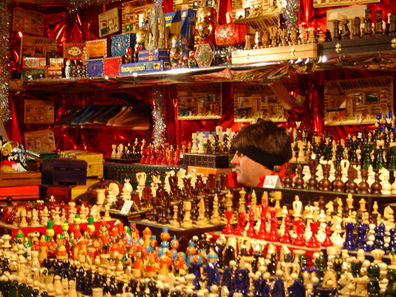

Reims, France. Early December. Temperatures way below zero. Five friends in a lively Christmas Market. A guy in his booth sells chess boards and pieces. He probably dreams about being a chess piece himself.

_Picture taken by my friend Albert_