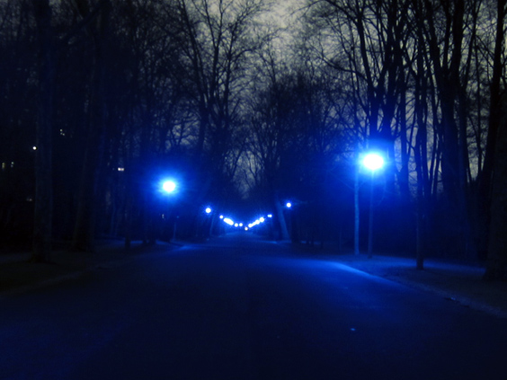
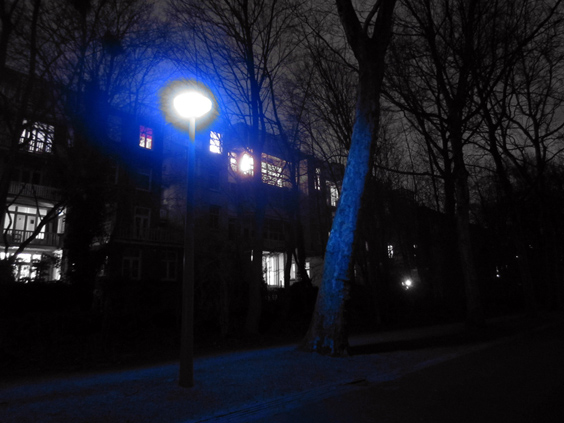
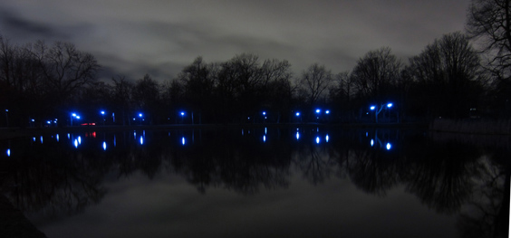
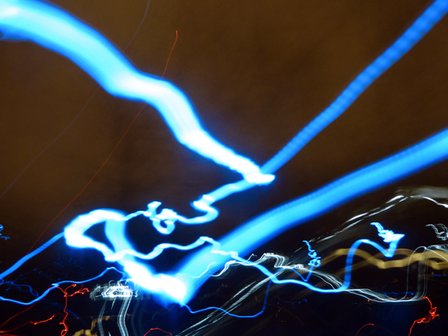
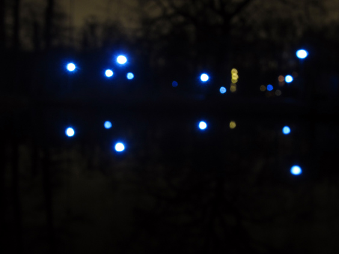

Some time ago I published a few takes on some of Vondelpark's colors, <a href="http://famsterdamlife.com/2011/12/vondelpark-green/">green</a>, <a href="http://famsterdamlife.com/2011/11/vondelpark-yellow/">yellow</a> and <a href="http://famsterdamlife.com/2011/10/vondelpark-red/">red</a>. I couldn't foresee that another color would have sprung up, but here it is: the entire Vondelpark has shifted to a deep, electric blue.

From an idea of [Steve McQueen](http://stevemcqueen.com/biography), the lights in Vondelpark were [all changed to a bluesy blue](http://www.overdose.am/2012/03/05/steve-mcqueen-turns-vondelpark-into-a-blueish-blues/) for a few weeks during March 2012.

This incredible change affected the entire park: benches, trees, water, bushes. The usual idea of a green area was swapped with blue, altering completely all vibes and feelings. The overall effect was somewhat warmer and somewhat colder.

The next image was taken by a friend of mine, letting the camera capture light for 15 seconds in a row while riding the bicycle.

Vondelpark had never been so unfamiliar. My most intense impression was of being on some alien planet.

