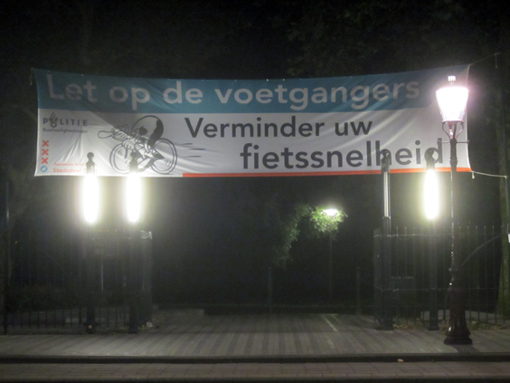

Each country has its own problems, right? Each and everyone. Some deal with famine. Some with dictatorship. Some with free roaming weapons. Some with Berlusconi.
By looking closely at the problems that one country faces, you can get an idea of its general wealth. Often times it's a much clearer indicator than the tricky GDP, HDI and similar ones.

I live in the Netherlands and, should I wonder how the country is doing, here's one hint. One day, in a park closeby, a full rally was held to protest against cyclists moving too fast. "Pay attention to the pedestrians", says the massive banner at the gate.

How wonderful must life be if one of your priorities is that cyclists pedal too fast in a local park? I wondered, really some people didn't have anything more important to invest their problem-solving skills in? Not a single more concerning causes?

Personally I think that there are are FAR more serious issues to fix in the Netherlands. I am sure that I am missing something here, I don't know anything about the background--maybe a kid was killed by a distracted moving bicycle. Still I think that a country must have taken a lot of steps forward if some people feel the need to fight such a problem.