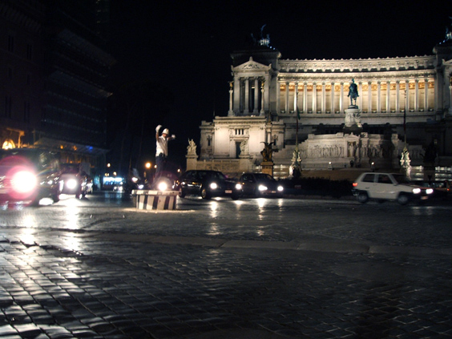

Can you see him? No, not the building. I'm talking about the guy in the middle of the picture. An urban figure from other times. The policeman there is "directing traffic". His arms and whistle give imperative orders to the drivers, who attempt in turn to kill him with generous portions of smog to inhale.
This is Rome and I last spotted such figure there in 2005. They must be extinct, but by all means prove me wrong if that's the case.