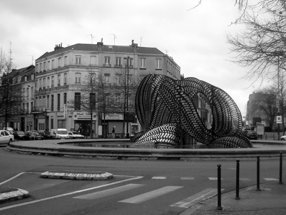

If you happen to be in Lille, France, there is one neighborhood that you shouldn't miss: Wazemmes. Just where _Rue des Postes_ meets _Rue de Wazemmes_, there is a roundabout with a fountain in the middle, which contains this structure that vaguely reminds of a snake. Why oh why I ever left Lille?