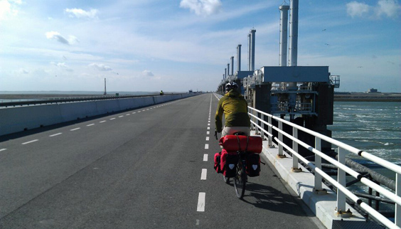

Hey all -- the blog is temporarily in standby as I'm currently bike touring in the south of the Netherlands, destination Belgium and beyond! 
This picture is me riding on one of the massive Dutch dikes in their southernmost region, Zeeland, which is what 'New Zealand' got its name from. 

What can I say... I'm feeling awesome! After the first days my body is getting in shape and strolling freely through this amazing land is priceless. The bicycle is definitely an amazing way of exploring the world, even better than walking.

I've been busy enough and lazy enough not to schedule any posts for the forthcoming weeks, so I wish you all a fantastic month of May!