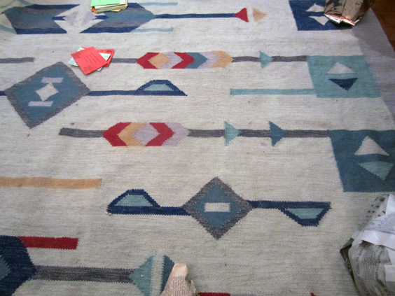

We never really realize how important the ground beneath our feet is.

I got away with a stylish opening line. This awesome carpet has been the ground beneath my feet for many years in my teenage room in Rome. I would know everything about it: the little defects in its design patterns, its smell, the stains that won't go away. It was a life companion that I will never forget. I nailed a flashy ending line too.