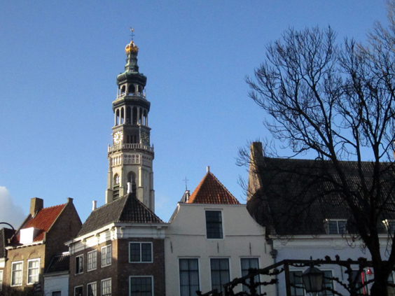

Middelburg is the sleepy capital of Zeeland, the region best known for having given its name to New Zealand. I've cycled there during my <a href="http://famsterdamlife.com/2012/07/amsterdam-to-paris-check/">journey to Paris</a>. This is a nice shot of the cathedral of Middelburg, which is another Dutch town where you can never be sure about what's crooked, the houses or the towers.

