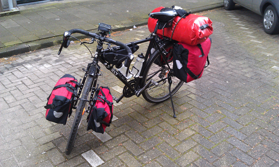
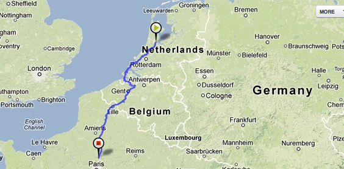
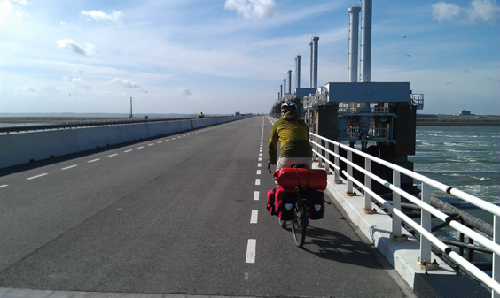
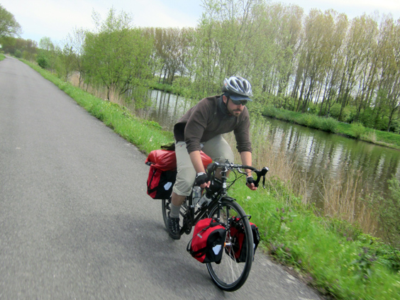
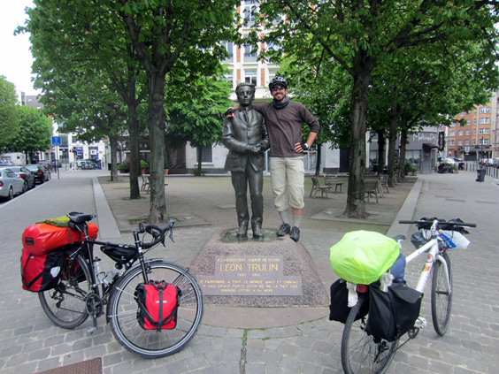
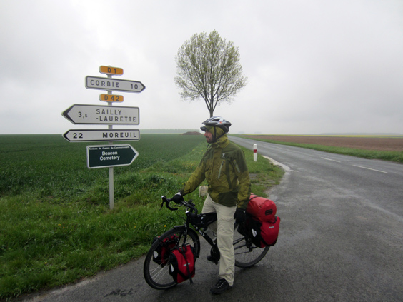
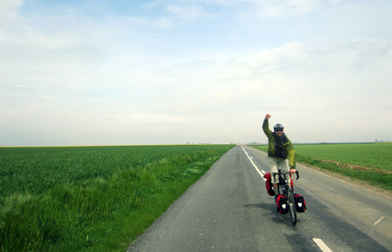
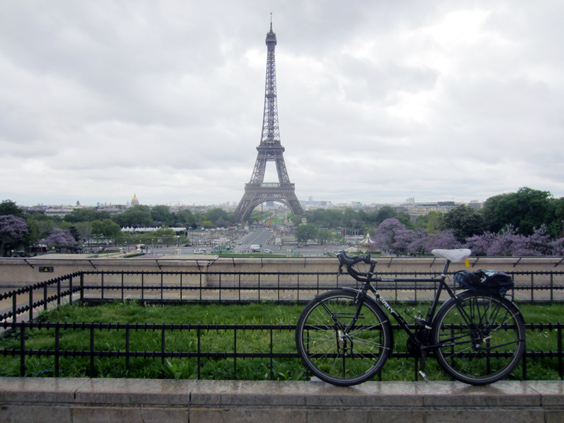

Hi all, long time no see! I left you at the beginning of my bike tour from Amsterdam to Paris, almost three monts ago already! No worries, I have safely come back home since then, only the blogging seems to have suffered from it. I'll maybe go over it in another post. Here I just want to share a tiny selection of my two-wheeled adventure through the unforgiving spring of 2012!

This is the route we followed. A total of about 750 km, spread over ten days of cycling.

**1. THE NETHERLANDS**

The beginning is always exciting. I rode alone from Amsterdam to Delft, where I met my touring parner, Claudio. He'd flown to Rotterdam on the same day, and the next day we headed south through the Zealand region. Yep, the one that New Zealand was named after. The most exciting part was indeed to cross the [immense dykes](http://richardtulloch.wordpress.com/2010/01/29/bikes-on-dykes-cycling-zeeland-netherlands/) that reclaimed land from the sea.

Great fun was also to board our bikes on a few ferries here and there, notably the one from Vlissingen to the last part of the Netherlands. It took us about 4 fantastic days to reach the border with Belgium, while crossing lovely villages and overlooking the vast, wind-ridden Southern Dutch shores.

**2. BELGIUM**

We spent our first night and a rest day in the fabulous Ghent and then we followed the river Schelde all the way down to France, which is actually one of the stretches we enjoyed the most. We didn't like Belgian roads very much, often composed by huge concrete blocks planted next to each other, and their cycling infrastructure is very pale compared to the Dutch one.

**3. FRANCE**

The first towns that welcomed us in France were Roubaix and Lille, where I used to live back in 2004! Entering Lille again triggered an avalanche of memories and the compulsive need of checking back some of my most important spots back then. One of the first one was a picture with the mighty _[Leon Trulin](http://www.remembrancetrails-northernfrance.com/visit-the-sites/the-war-of-movement-and-the-first-german-occupation/monument-to-leon-trulin-lille.html)_. We never really learned about him but we tipsily hugged him so many times. 

Weather-wise, France was slightly nicer than the previous two countries, but we also had the absolute worst day. Admittedly I look more like a samurai than a holiday biker, but well, shit happens and rain too.

Despite the excess water, cycling through France has been the best part of it all. The bicycle infrastructure is almost non-existant, but we found it to be better like this than the poorly implemented Belgian one. Here we strolled happily along fantastic countryside roads with zero traffic on it, which was like having a huge bike lane all for us. The gentle hills and tiny villages made for an unbeatable setting and a more varied cycling pattern than the pancake flat Netherlands. We're almost there.

The entrance into Paris was not as you'd expect. For how much we love the image of pedalling through the Champs-Élysées at the end of the Tour de France, Paris issue is the surrounding areas. Before reaching the eternal city centre, you need to cut through 40 kilometers of suburbs. We rode through a rather horrible industrial zone: nasty roads, traffic and noise. But once inside Paris... wow, what a breathtaking city! Claudio and I parted ways, and I enjoyed one week in the _ville lumière_, which was amazing. After two days though, I already wanted to get lost in countryside again with my bike.

