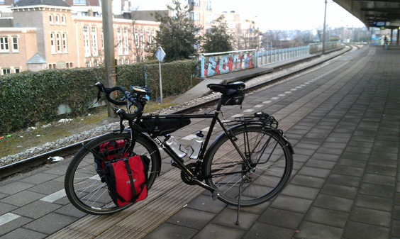
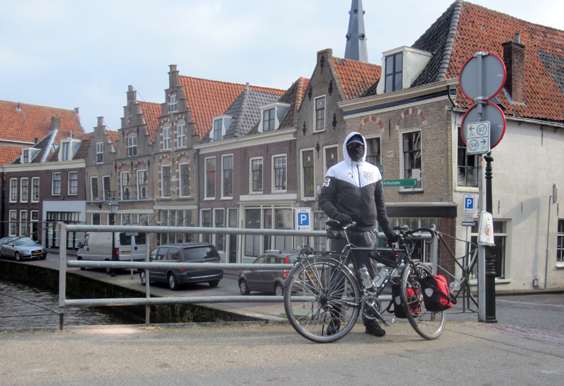
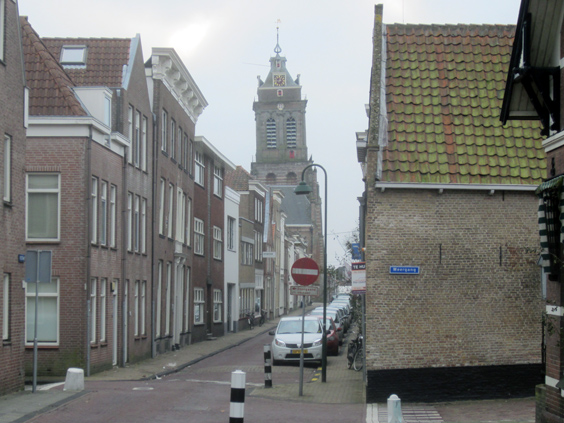
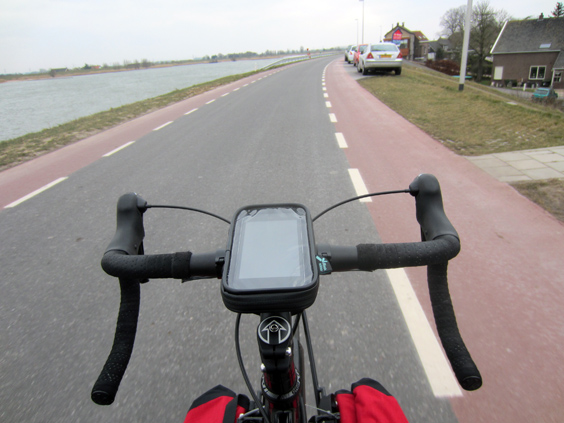
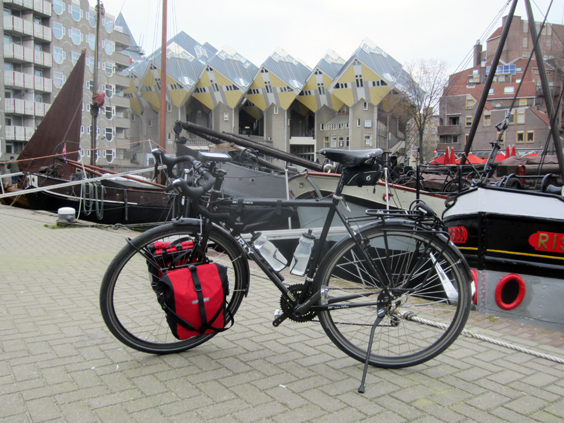

The cycling season 2013 has officially begun! Yesterday I went for the [first long ride of the year](https://www.bikemap.net/en/r/1990160/), and what a ride it has been!

Around 9am I took the train from Amsterdam to Woerden, a town close to Utrecht, where I spent an hour with a friend before starting the actual ride. My destination was Rotterdam, to attend the birthday party of another friend that same night. I was quite well dressed: 5 layers on top (including a plastic bag between my t-shirt and the first fleece), long johns below my cycling pants, three pairs of gloves and 2 socks. No rain was in sight, so my only enemies were the -2 degrees. Here's how I looked like when I reached Oudewater.

Cycling fast warms you up, and I felt good, except for one detail: my feet were freezing. I almost lost sensitivity there! I stopped for lunch in Schoonhoven, roughly halfway, where I contently realized that I still had feet. While there I also found out another dramatically leaning chuch, like the one in Delft! Such findings are the tastiest bit of my rides, but obviously Dutch architects haven't played enough Lego when they were kids.

The town was my point of contact with the companion I was looking for: the river Rhine. Or better, one of his final branches before meeting the North Sea. I followed it all the way to Rotterdam. Majestic, powerful yet calm, slow yet unstoppable. The 35 kilometers that I cycled next to it felt somehow a lot warmer than the previous ones.

Just as it happened with Paris, the entrance in Rotterdam was not the nicest one. The industrial areas around it are quite grey and sad. I even cycled next to a building where I did two job interviews some time back. I silently thanked God for having declined both offers and cycled ahead.
And then finally I entered the Rotterdam I love and enjoyed its "waterline", impressive bridges and artificial islands. Before going to the party and enjoying my friend's hot rain shower, I had to salute what remains to me the most special spot in town. If the first ride of the year was this beautiful, I can't wait for the rest!

