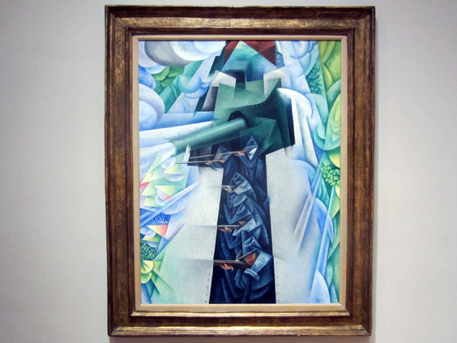
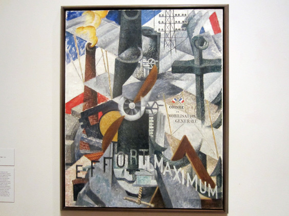

Recently I was thinking about this blog and its content. I haven't touched it for a while--and a little distance from something always favors some lateral thinking. I came to the conclusion that this blog has to be about what I like and what passionates me about writing and sharing. There would be a lot of other reasons for blogging. I believe many bloggers come to this point at some stage, especially the financially successful ones. I decided to write when and about what I feel like. If pocket money comes from it in the form of advertisement, then all the better.

So well, last year a visited quite a few impressing museums. The older I grow, the more I appreciate them, the more am I touched by incredible art and its stories, the more I regret having had shit art teachers throughout my education. I felt like posting about some of the highlights I found, so here we go.

This next one is "Armored Train in Action", by the Italian futurist Gino Severini, painted in 1915.

In August 1914, as World War I broke out, the [Futurists](http://www.unknown.nu/futurism/) planned public demonstrations in support of Italian participation. Severini was based in Paris (France and Italy were allied at the beginning of the war), and created included symbols that evoke the trappings of modern warfare, such as cannons, flags and smokestacks. The Futurists were eager to break attachments to the past, and war, they felt, was an opportunity for an historical "tabula rasa", a chance to create a new world order.

We all know how wrong they were. War doesn't work like this--let alone modern warfare. What we can admire here is not its dreadful message but how it was conveyed, and what a powerful insight this is about their ideas at the time. The next painting is "Virtual Synthesis of the Idea - War", painted in 1914 by the same artist. Both paintings are exposed at the [MoMA](http://www.moma.org/collection/theme.php?theme_id=10085 in New York.

