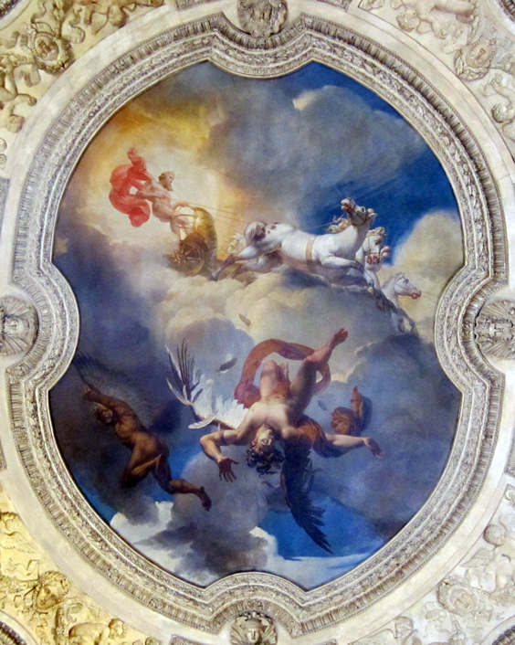

Last year I was visiting the Louvre museum in Paris.
...with such an introduction, you're probably now expecting a super famous thing like the Mona Lisa. Instead, I'll show you the thing that I remember the most vividly: a casual ceiling. I was walking through the rooms, when I raised my eyes and saw this painting on the ceiling.

This is the story of Icarus, the ancient Greek story where Icarus, son of Daedalus, flew too close to the Sun which melted his wax-powered wings, causing him to drown in the sea and that specific sea to be named afer him.

I stared at the piece for 30 minutes, and concluded that it'd be worth alone the visit to the Louvre. It is SO beautiful. I went home convinced that I had spotted some casual unknown ceiling masterpiece, but then found out that it gets the recognition it deserves: it was painted by Merry-Joseph Blondel in 1819.