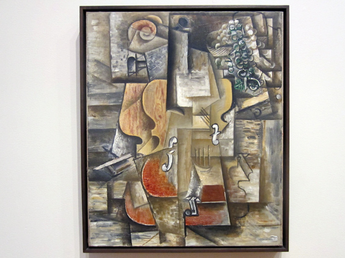

Pablo Picasso loved musical instrument, that's a no-brainer. What I find most interesting about his _Violin and Grapes_ is that the main subjects are not decomposed in squares or other geometical forms. It seems instead like they have been 'sliced' into multiple planes. The effect reminds that of a broken mirror.

