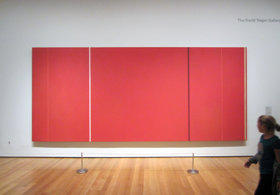

This painting by Barnett Newman has one singlemost visible quality: it's a **BIG** motherfucker.

With its 5.5 meters long and 2.5 meter tall, if you walk close to it, you'll be completely surrounded by its saturated red and that will be it. This Newman guy belongs to the Chromatic Abstraction school, where the artists use color as the primary vehicle of expression.

The name of the painting is **Vir Heroicus Sublimis**, which is Latin for "Man, Heroic and Sublime", and it was honored with a lot of metaphysical interpretation, notably that the artist wanted to capture both tangible and intangible. I'm not quite sure what to think about it. But if you walk close to it you really only see red around you.
