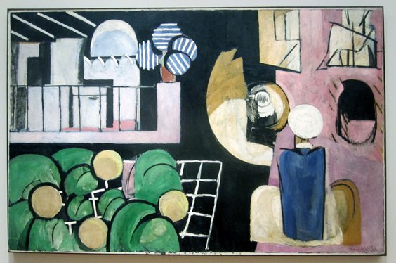

One of the problems of sharing this paintings on the internet is that one has no clue of the dimensions of the paintings. [**The Maroccans**](http://www.moma.org/collection/object.php?object_id=79588) by [Henri Matisse](http://en.wikipedia.org/wiki/Henri_Matisse) is big, 181.3 x 279.4 cm. That's almost three meters wide!

This painting doesn't really display incredible features, it's "simply" a very good one. When you see it in front of your eyes tho, it evokes feelings **à la "One Thousand and One Nights"** and one suddenly finds himself in the [opening scene of Walt Disney's **Aladdin**](http://www.youtube.com/watch?v=RW5n4sIOj9s).