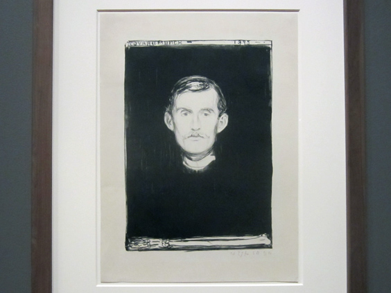

I don't really know what to say about this self-portrait of [Edward Munch](http://en.wikipedia.org/wiki/Edvard_Munch), the Norwegian artist who (probably) most influenced the Expressionism movement. His life was such a continual series of tragic events that one wonders how he made it this far without antidepressants. If you're curious, make sure you're not close to any top-floor window and read the wikipedia page I linked above.

This selfportrait doesn't only convey his illness, loneliness and depression, but also his acquiescence and resignation. His left arm is a skeleton one, symbol of the Death lingering upon him. All of his famous works are extraordinary. They are deeply beautiful and moving. The next post will be merrier than this, I promise.