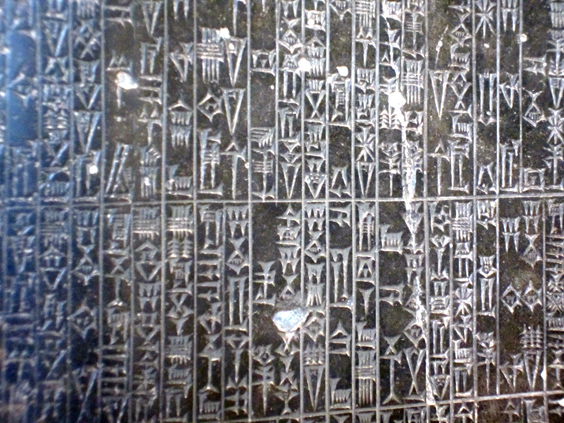
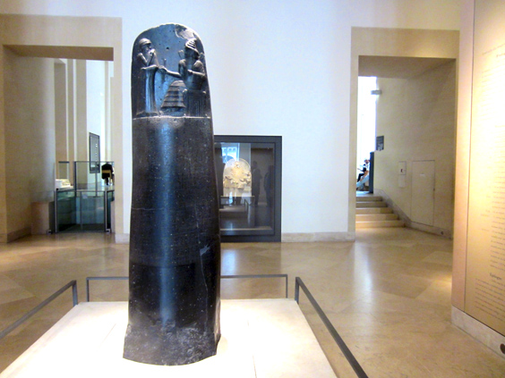
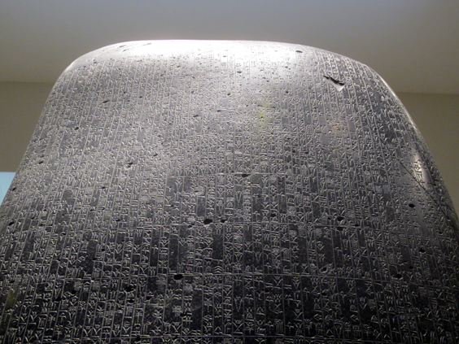
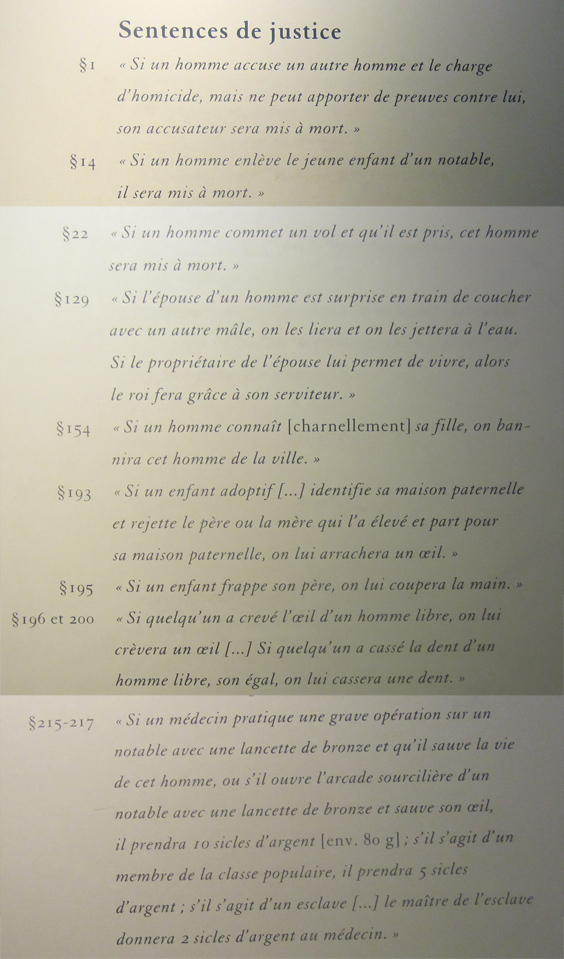

Paris, _la ville lumière_. After my bike journey from Amsterdam to Paris, I spent one week in the city, staying at different friends and exploring the various **arrondissements**. One of the most impressive museums that I visited was, of course, the Louvre.

Blogging about the Louvre is an impossible task, one can maybe select a few things and write about them, like I already did once with The Fall of Icarus. This time around, I'd like to write a bit about one of the pieces in there which captured me the most: the [Code of Hammurabi](http://en.wikipedia.org/wiki/Code_of_Hammurabi).

The Code of Hammurabi is one of the oldest law collection that we know of. What I have seen is a fantastically preserved copy, a stele with the inscribed laws. Its shape reminds vaguely of an index finger and it's 2.25 meters tall.

With the exception of the bas-relief, the stele is entirely covered in [Cuneiform script](http://en.wikipedia.org/wiki/Cuneiform_script), one of the earliest form of written language. This is how it looks like from closer.

Now room for some considerations. This stele probably encompassed the entire set of regulations of an entire state. Matters were simpler then, I guess. The justice principle underlying these laws is the 'eye for an eye', according to which someone who has injured another person is penalized to a similar degree. "If some dude breaks someone else's tooth, then a tooth of him will be broken".

This list of crimes & punishments hands down to us a crystal-clear picture of what life must have been like in 1770 BC. Three features impressed me the most.

First, these laws are all related to individuals. The concept of 'crime against the community' (such as corruption or tax evasion) didn't seem to exist back then. Every rule is directly applicable to a physical person.

Second, most of the punishments were physical injuries. Like chopping hands to thieves, exile rapist or kill assassins. Some rules involve money, but it's mainly for rewards. Nowadays sanctions in Western Lands resolve basically into liberty deprivation (jail) and financial penalties (fines, expropriation of goods).

Third, in this law from 3300 years ago there is already trace of class difference among citizens, where a rich offender (or rewarder) has to pay more than a poor one.

I tried to imagine what would have been the job of a judge back then. I'm sure that everything would have been sensible to interpretation, and a lot must have been improvised beyond this code. I instinctively thought about Silvio Berlusconi and what would have happened then to people like him. Was there room for such manipulators, layers who turn law to their interests, corruption of judges, bribing of witnesses, politicians who abuse their power to be virtually immune to the rules? Probably yes.

These below are a few examples from the stele, translated into French. The famous one, which gives title to this post, is number 196.

