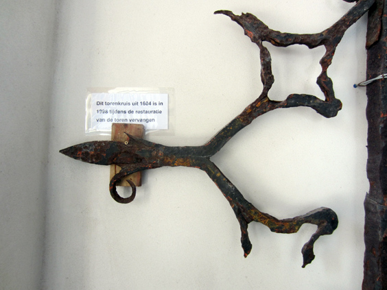
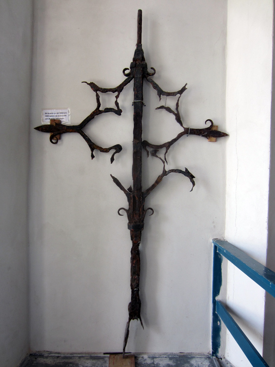

Islands. The concept itself evokes isolation and inbreeding. Maybe not anymore. What is certain is that Texel, the biggest one of the Dutch islands, is surprisingly similar to the rest of the country. Flat, fields, sheep and occasional horses. Don't get me wrong, it's a great place and I had a real blast while there--I should probably write more about it separately.

Texel has a "capital" which responds to the name of Den Burg. In the middle of the town there is a church, you can climb up and all. The detail I want to share here in the Art section is a that at some point they took the top cross down, replaced with a new one and put the old one against a wall. This operation took place in 1998, after the metallic cross had been there since 1604. It means that this cross has stood the crappy Dutch weather for 394 years!

Quite incredible I must say. Wind, rain, hail, snow and sheep droppings hit relentlessly this cross with all their haste for almost four centuries. In the picture below you can see the entire cross. Who do you think has won the match?

