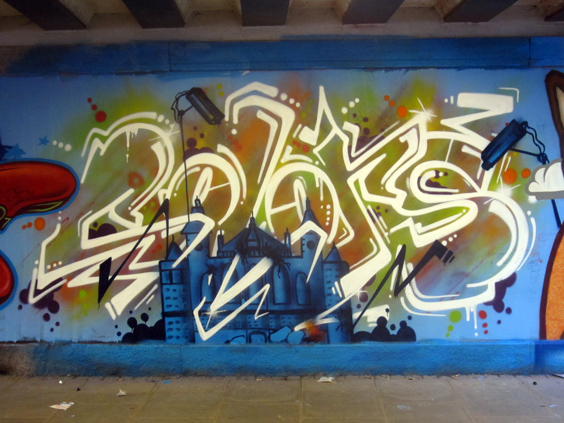
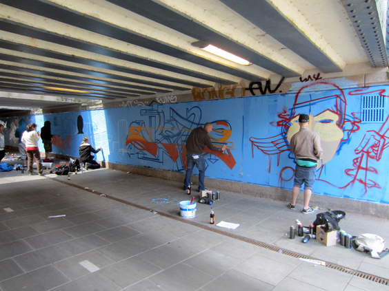
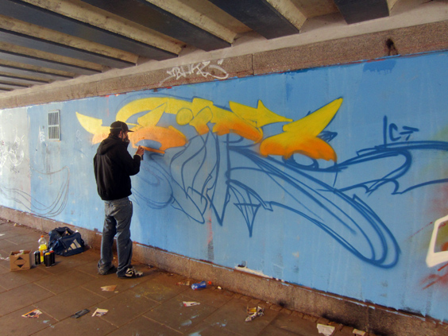
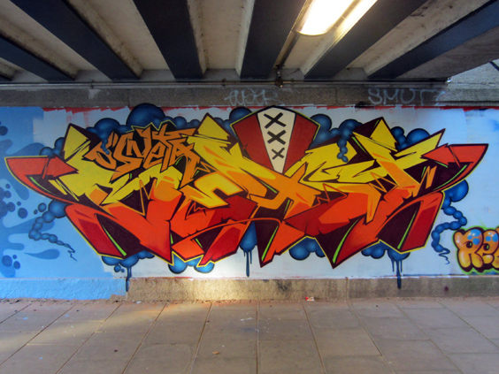
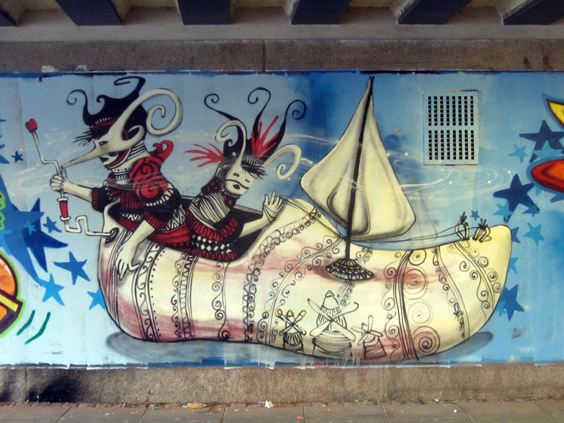
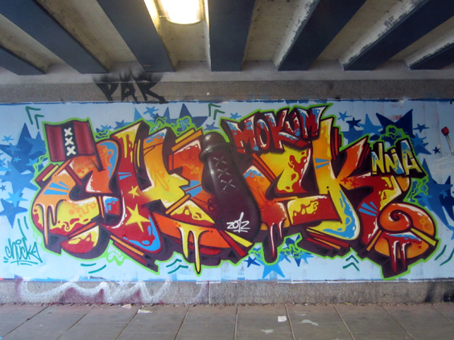

Some time ago, I was cycling back home in Amsterdam, and I decided to take a slight detour to pass somewhere else for a change. As I approached the tunnel below the railroad, I saw a lot of unusual activity there. It turns out that the people from the nearby squat Op de Valreep _(edit 2019: it doesn't exist any longer)_ had organized a day to decorate the tunnel mentioned above.
After painting the wall in a light-blue, neutral color, each street-artist got a section of it and began his work. Colors, beer and orange juice the most important tools.

The place wasn't the best for pictures as the light was highly variable in a tunnel, yet some came out quite nicely. Here below is a health-aware street artist wearing a gas mask as he sprays. Breathing in the tunnel was indeed quite hampered.

I left after a while and rode into town to enjoy the sun with my sister and two visiting cousins. Upon coming back at night, I headed back to the tunnel to see how things were going. Everybody had left and the graffiti were complete, some of them still drying.

I felt lucky as I could enjoy this new art at its shiniest point, before it'd share much of its brightness with the unforginving Time. Here are some of the works. More will follow one day.

For some interesting pictures around the squat, give a look to this [Flickr gallery](http://flickrhivemind.net/Tags/valreep/Interesting).