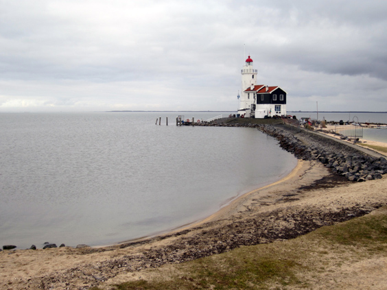
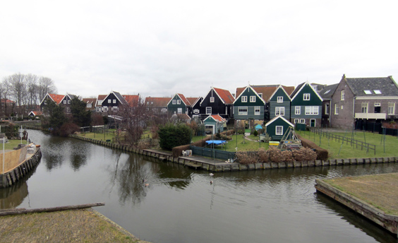
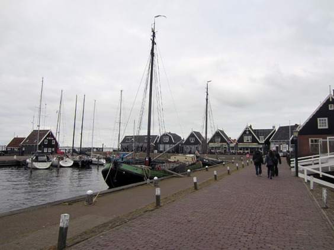

Among all the bike rides around Amsterdam, [this](https://www.bikemap.net/en/r/1429643/) outta be one of my favorites, and here I'll write about the first time we conquered it!

The way there is fabulous: the [lovely fishermen village of Durgerdam](http://www.amsterdamcityblog.com/tag/durgerdam/) is just a stone-throw away from Amsterdam, yet it seems stuck centuries in the past. Then you follow the coastline all the way to the island... as you maybe remember from my previously failed attempt to reach it!

This time around I went there with my friend Bert, we cycled all the way to the eastern tip, where you can see this bad-ass, marvelous lighthouse.

The weather was quite nice, a little on the cold side but the wind was peaceful. We completed the tour of the island, which still boosts a lot of traditional cute wooden houses.

The little harbor is on the western side of the island: this is where ferries loaded with tourists dock while they take coffee & pictures. We agreed that a coffee with _appeltaart_ (apple cake) was the best way to celebrate our insular achievement before heading back to Amsterdam!

