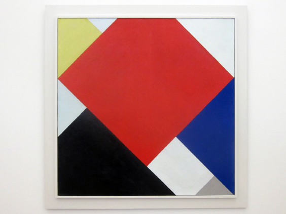

This painting van Theo van Doesburg belongs to the [Elementarism](http://www.visual-arts-cork.com/history-of-art/elementarism.htm) theory, an overcomplicated and [über pretentious](http://modernistarchitecture.wordpress.com/2010/10/19/theo-van-doesburg-%E2%80%9Cpainting-and-sculpture-elementarism-fragment-of-a-manifesto%E2%80%9D-1927/) idea from the 1920s.
Like Mondriaan's Neo-plasticism, it was a branch of the De Stijl school, playing at the same time both the brother and the arch-enemy of Neo-Plasticism. The main difference being that here the lines are diagonal instead of horizontal/vertical. This pissed off Mondriaan so much that he resigned from the school. You'd think there'd be worse problems in life, but don't underestimate the power or lines.

