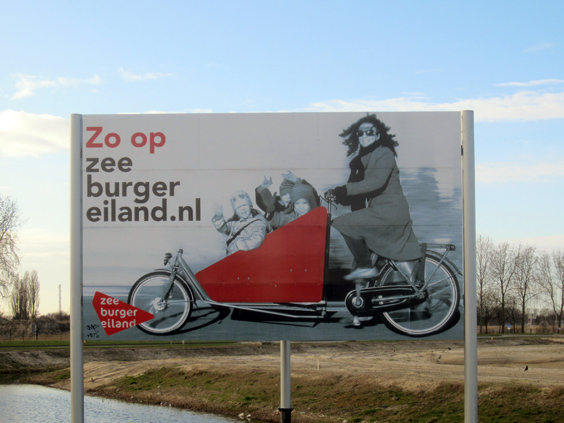
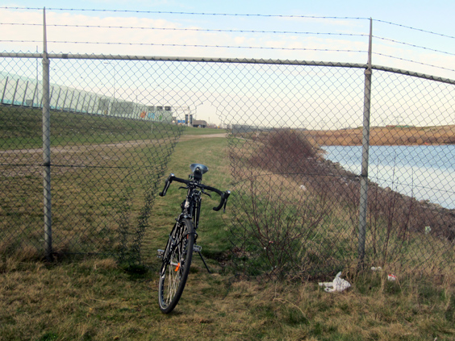
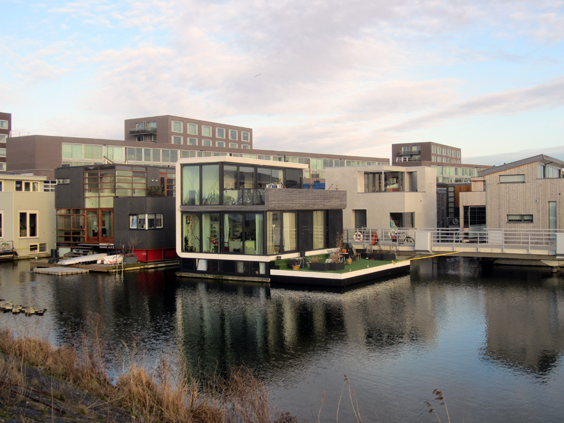
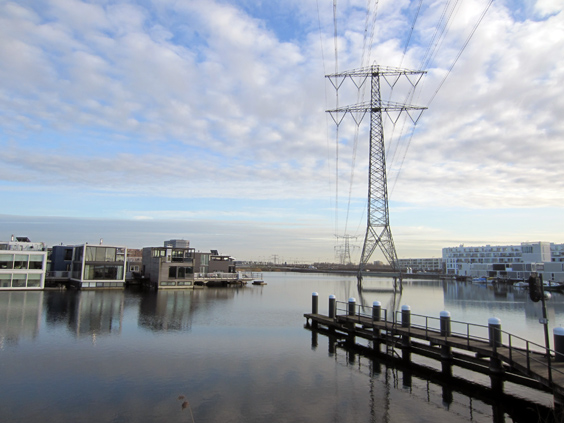

Not all rides need to cover hundred of kilometers. I often mention the exploratory trait of my rides as the most important one, and even in your backyard there is always something new to explore. So one day I took my bike and explored my backyard!

Zeebug island and IJburg are two artificial islands where the city development goes steadily ahead. Their modernity is thrilling and their actuality is fascinating. This is the interactive [map of the ride](https://www.bikemap.net/en/r/1467289/).

As you can see from the map, I rode a bit next to the highway! At some point I spotted a fence in the distance and feared a forced comeback on the same way... but rode till the end of the field and magically found a hole in the net, just like if I'd been in Italy!

IJburg is really a vibrant place, things change by the day and it hosts a lot of different[projects](http://launionart.wordpress.com/2012/12/11/the-blue-house-project/) and urban experiments. I read about one, for instance, where difficult kids in their 20ies were given a room in a house with other students coming from different social layers, to promote integration and see which benefits would come out of it. Pretty cool huh? I think I remember it actually didn't turn out very successful, but hey that's why we do experiments.

Buildings are very interesting, built to gather as much light as they can. Look at this house on the little lake--doesn't it look like a Lego City item?

That lake is actually artificial like anything around it. There is one huge electricity pylon right in the middle of it, and what struck me is that it fits PERFECTLY. I think the lake would even look incomplete without it. Don't you think?

