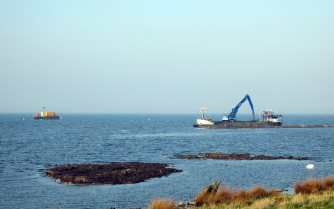
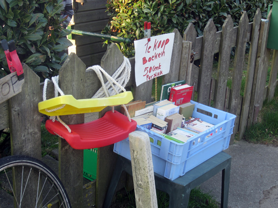
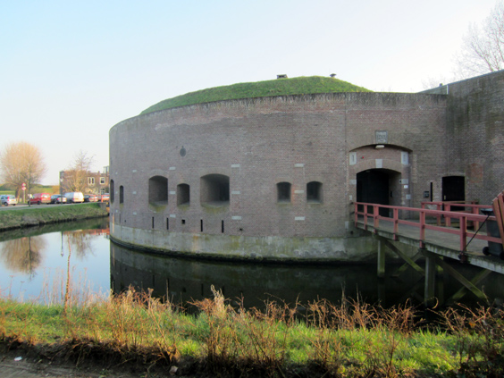
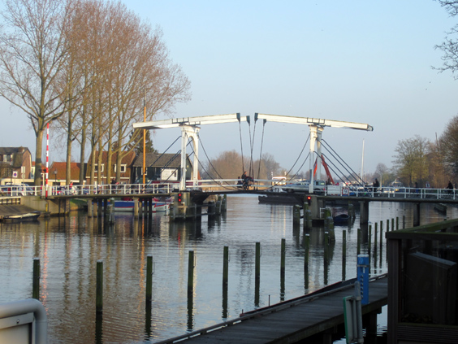

Have you ever wondered how [polders](http://en.wikipedia.org/wiki/Land_reclamation) are born. For those of you who might not know, a polder is drying the hell out of a water area (such as a lake or portion of the sea). The Netherlands boost some 3000 polders.

In the picture above you can see the basic of polder creation: a ship fully loaded with dirt positions itself and starts dumping it into the water. Easy-peasy. The process is repeated until you create an artificial lake, to be later drained.

The polder is at the 10th km of this little [bike ride](https://www.bikemap.net/en/r/1469106/) to the East of Amsterdam. To follow the ride, pass the mouse oved the box with the "altitude" below!

After the polder I passed by Muiden, which is always a nostalgic view to me as it was the destination of my first (racing) bike ride ever! I then followed the river Vecht, along which I found this lovely old guy selling used books for 50 cents each. He told me he'd been living there on his boat for 35 years.

The destination of my ride was Weesp, a rather regular town in the outskirt. Its defining building is a circular fort that was build to guard the traffic on the river. Funny detail, it was completed in 1861, the year when Italy became one single nation! Believe it or not, this for is nowadays used as a private office space for rent. Something even more bitter than the usual restaurant.

Weesp also has a cute bridge over the river. I can't really say why, but I found something hypnotic in it.

