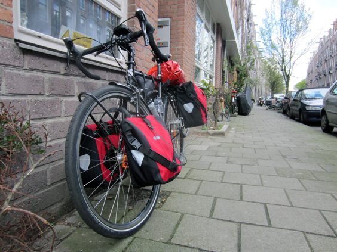
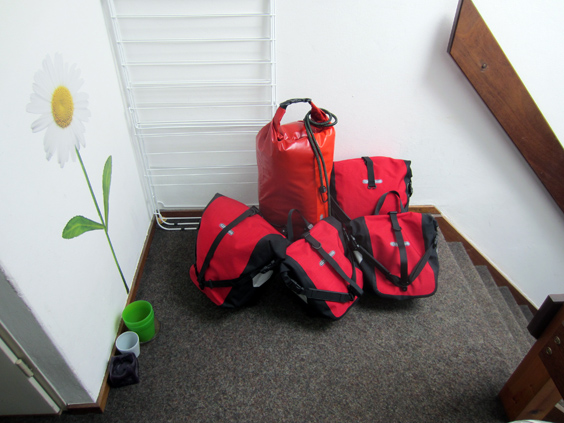
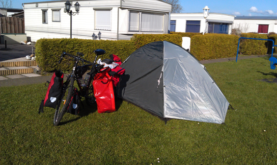
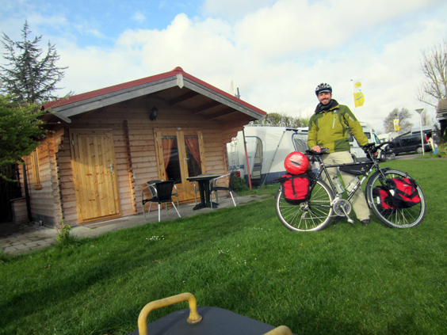

Ladies and gentlemen: I'm going to describe the very first night out alone as a touring cyclist! This ride was the 'equipment test' before leaving for my bike journey from Amsterdam to Paris. Check how stylish my bike looked like when fully built for the very first time.

Here is the [full route](https://www.bikemap.net/en/r/1526793/), distributed over two days. 

Packing stuff is a crucial activity, and even though it was going to be one simple night out, I wanted it to be 100% adherent to what the real journey would be like.

I had chosen a camping just outside of Haarlem, roughly at the 26th kilometer on the map. I'd been on this route before, yet I managed to take a couple of wrong turns, hence the funny map pattern around km 15. The weather was quite pleasant and I arrived at the camping with the sun still high on the horizon.

Can you recognize my tent? It's the one I bought with Guido in Punta Arenas, in the Chilean Patagonia, and that we used in our 3-day hike in the trekking in Torres del Paine national park!

That night I cooked on my camping stove, tried out all possible ways to lock the bike, tested my night equipment and slept like a baby, alone in my tent, with the lulling sound of the rain outside.

The morning exercise of folding everything back again was equally important to learn the process. Here I am ready to hit the road back after everything had been packed again. I gained a lot of useful insights with such a 'drill-ride'. Don't leave for a long trip without having done yours!

