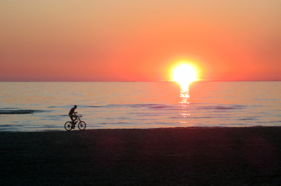
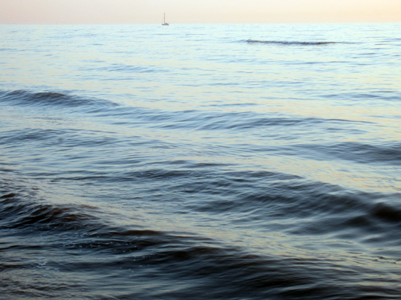

The summer season allows plenty of bike rides after office hours, because the days get so long. One sunny day, we decided to cycle [to the seaside](https://www.bikemap.net/en/r/1726293/) with my friend Bert, the same I conquered Marken with!

This time around, this incredible sunset was our ultimate reward.

The color of the sea was really impressive. The shade of blue was light but very intense at the same time, it was hard to believe! Check these colors out:

The only other time that I saw a sea with comparable colors was at Squeaky Beach, next to Esperance, Australia.

The ride to get there was mostly known, except for the last 5 kilometers through the dunes. The dunes are a much hillier area, with proper inclines and declines. It felt good to enjoy the downhill wind! Check the altitude measurements on the map here below (or open the post in the browser if you can't see it in your email/RSS). We reached the staggering height of 20 meters MSL. Definitely a ride that I'm going to do again and that I highly recommend.

