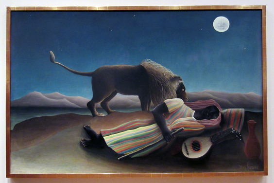

Today's Art item is _The Sleeping Gypsy_ from Henri Rousseau. He was a member of the [Naïve](http://en.wikipedia.org/wiki/Na%C3%AFve_art) school, which has been active for a strikingly long time, compared to other contemporary styles: the first recognized work dates back to the 18th century and it lasted till our days. The name "Naïve" comes from the simplicity of the paintings, where colors and perspectives rules are almost never respected. I had a similar painting in my house when I was a kid. There were a lot of animals and I always thought "wow, this must have been made by a kid like me". Instead it was just a naïve artist.

