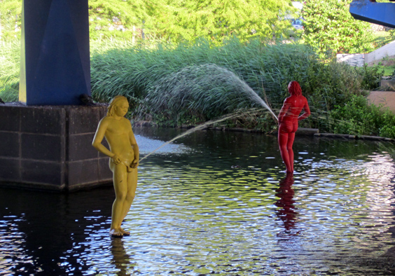
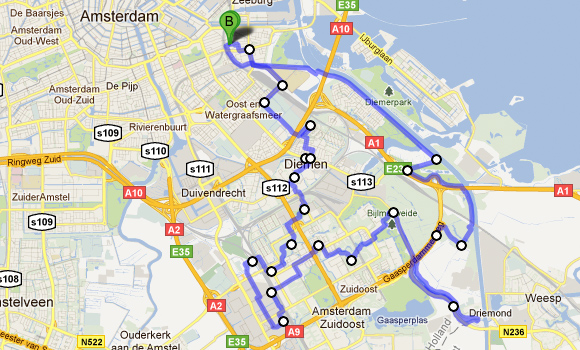
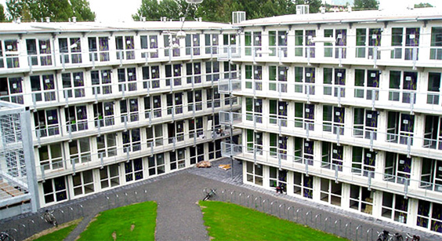

A friend of mine argues that urban landscapes are the best. I partially agree, as I described best in a previous bike ride to Abcoude. This time around, the bike ride also had a functional goal: buy some stuff from Ikea. "Buy furniture at Ikea is not an ideal situation for a bike!", I hear screaming from the back rows. I couldn't agree more.... now. You should have told me before!

Where does the name of the post comes from? On the way to Ikea, I cycled through the Bijlmer again. And I was amazed by what lies under Dutch tunnels for [the second time in my life](http://vimeo.com/9570235): I'm sure that nowhere else in the world you can stumble across _pissing men_ standing in the water.

The ride back from Ikea was complicated by the Ikea bag hanging from my back, but I enjoyed it nonetheless: I cruised through Diemen and, once back inside the ring, a sporting area full of hopping kids. 

I was struck by Diemen, the little town just outside Amsterdam's ring. It's a cheap living area, where minorities and not very rich people ended up. I find it hard to describe, but the atmosphere is vibrant. The impression I was left with is that "should change ever come to the Netherlands, that it's where it'll come from". 

I mean, that's where they put students to live in **containers**. Yes, containers, those that you usually see in harbors. I'm sure this will be a very efficient force for change. More on this in a future post.

