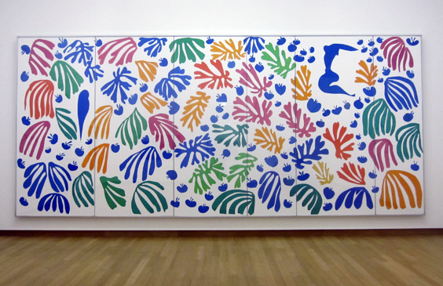

For many, Matisse is just one of the [Aristocat](http://www.imdb.com/title/tt0065421/)'s kittens. Before being a cat though, he was a famous French painter who belonged to a few different movements: Fauvism, Impressionism, Modernism and, I declare, Matissism. Why not.

This particular work is not even a real "painting": once too ill for painting, he used the aid of a few assistants to cut the shapes out of colored paper and glue them on to the canvas. You can identify two figures, a parrot and a marmaid, which replaced a snail that was originally there. Matisse was confined home, and said of this piece: "I have made a little garden all around me, where I can walk.".
The wide garden is at the Stedelijk Museum in Amsterdam.