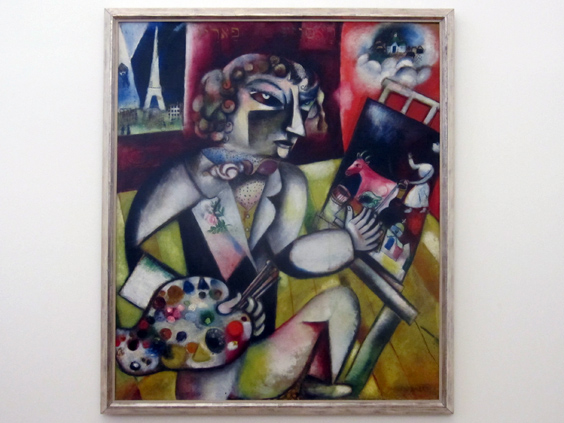

Marc Chagall has always been very important to me because one of his prints was hung in my parents' room. I'll maybe talk more about that one if I ever get to see it live. After learning more about the guy many years later (recently, to be honest), I found one more connection: look at this painting and I'll tell you about it after.

In this selfportrait, he depicts two places: his home country (Russia) and his expat land (can you guess which one?). "The parallel landscapes linger over the artist, emblematic of his expatriate condition, torn between the traditions of home and the opportunities of the modern world".
Noteworthy, his left hand has seven fingers. Maybe a reference to the Jewish tradition or maybe a intuition about the future movie [Gattaca](http://www.examiner.com/article/twelve-fingered-piano-players). Check the movie out, I watched in Geraldton, Australia and it's great.