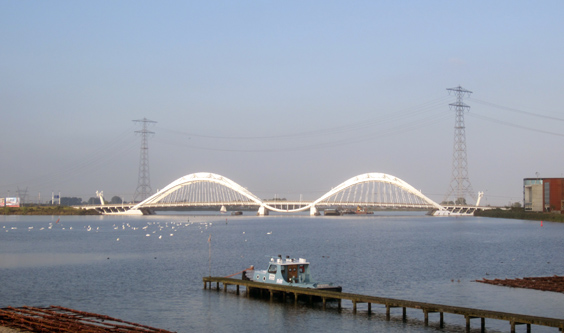
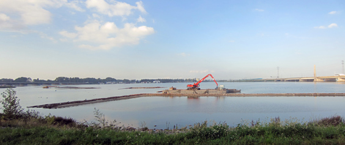

Hey hey, just a [quick-ride](https://www.bikemap.net/en/r/1824690/) to share with you a couple of new discoveries just in my back-yard. I rode again to IJburg, the latest artificial island development in Amsterdam, an area of incredible novelty and experimentation.

Approacing it from another "entrance", I was able to spot the bridge that I crossed in this other bike ride, definitely a nice one.

But also, I was able to spot a new polder construction! This time I took a panoramic picture: a big machine is dumping soil in the water, creating this little "pond", which will be eventually filled and voilà, another polder is done!

