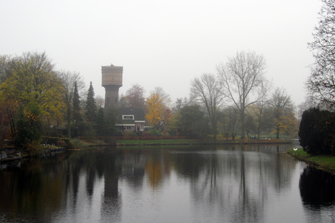
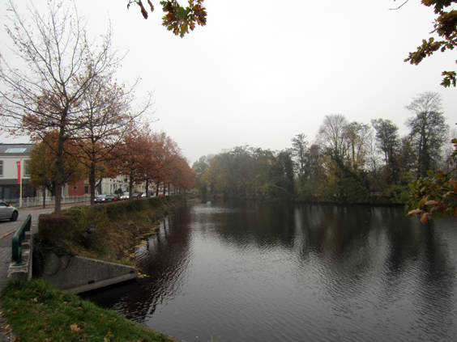
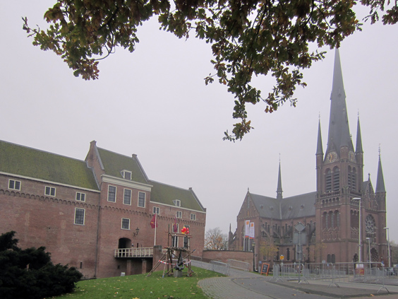
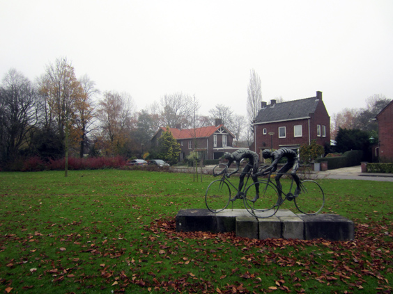

Hi peeps, this one that you see today has been the last ride of 2012. Autumn was in full swing but it already felt like winter. I took the train to Woerden, to visit a friend working at an open-air market, and from there rode back to Amsterdam. It was misty, damp and very cold.

Here follows the [interactive route](https://www.bikemap.net/en/r/1907392/).

This ride was basically the last chance for the year to see the autumn colors in the countryside. I was definitely worth it, too bad it was too cold to stop and contemplate for a little longer.

