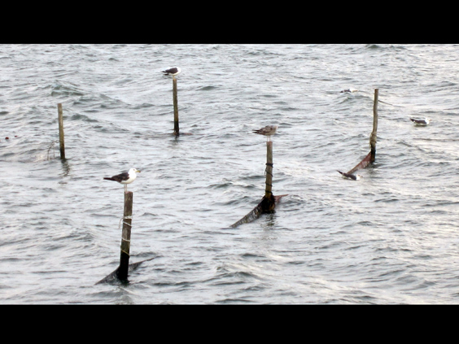
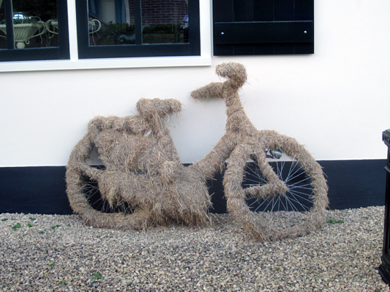
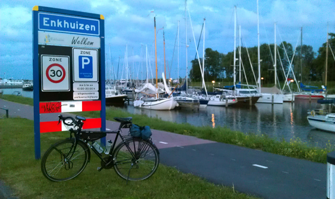

Among the best things of the Netherlands are the super long days that we get in spring and summer. During such times, there are still 4 or 5 hours of full sunlight available after office hours!

Those are the days when you can just leave for a bike ride after work and stretch out as far as you wish. Like this ride of mine to Enkhuizen, a town 70 km north of Amsterdam!

I left around 18 and arrived there around 22, so four hours time, including the dinner break in Hoorn (point B on the map), where I had cycled once with my friend Emanuele in 2008. Back then, with a regular city bike! I entered into town at the same spot along the sea where we did 4 years before. Wind-ridden and with the seagulls holding firmly their positions on the poles.

I had dinner on the main square, the _Rode Steen_ (Red Stone), same where we had attended a [drunken, orange town party](http://vimeo.com/9570235).
After dinner I hit the road again. My plan was to follow the coast, but that bit was unfortunately closed for renovation works, so I cut through the fields contryside.

I spotted a bike lying against a wall and wondered if the think musk coating was intentional art or rather negligence.

Some more pedalling and I finally reached Enkhuizen. My legs were beginning to feel sore and the digestion had kicked in, making it the right time to check the anchored boats and take the train back home!

