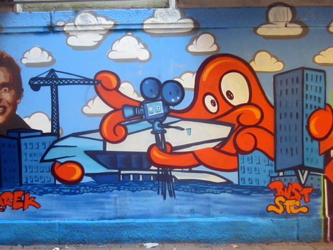
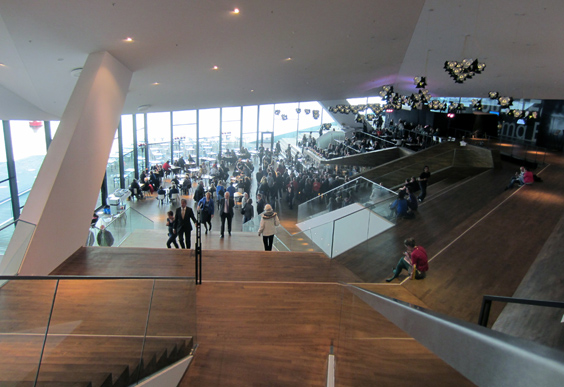
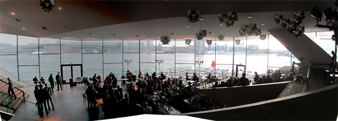
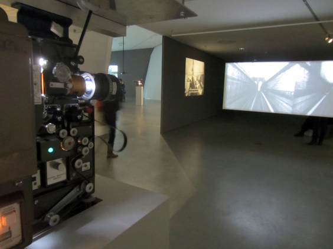
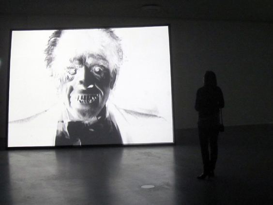

Once upon a time, in Amsterdam, there was a Film Museum in the Vondelpark. Born as a movie theater, it also held lectures, exhibitions and debates around the movie art. I've been there a few times before the entire museum was moved to a flashy new building in 2012. If you're curios, one article celebrates the [old film museum in lomgraphy](http://www.lomography.com/magazine/locations/2012/03/07/filmmuseum-vondelpark-a-requiem). Here we'll talk about the new one.

The new [Eye Film Museum](http://www.eyefilm.nl/en) opened its doors in April 2012. In the few months after its opening, the entire town was talking about it. It must have made a special impression on some street artist: this is a graffito that comes from the graffiti tunnel I blogged about!

The museum location is not quite prime, in Amsterdam North: you need to take the ferry to get there, which can mean some shitty waiting in rain & cold, especially in winter. Not a minor annoyance, considering that one of the spiritual mission of us all here is not to get an inch of cold more than strictly necessary.

The movie collection ranges around the 50.000 films. We visited it shortly after its opening. The first weird thing aobut it is its architecture. Super complicated, I don't think there isn't a single right angle in the entire building. This is for instanche the café:

The cool thing about the café is its terrace on the water, right in front of Central Station. Plenty of boats to look at!

There were screenings but also an exhibition about "lost movies", that is stuff that was meant to be published but for some reason wasn't in the end. Some bits were played using really old video cameras.

I wasn't impressed by the museum. I even bought some cards, which then sat on the shelf for months before being sent. Let met close this otherwise forgettable post with a close-up of a big-toothed guy from some forgotten old-ass movie in there. No offense to any big-toothed reader.

