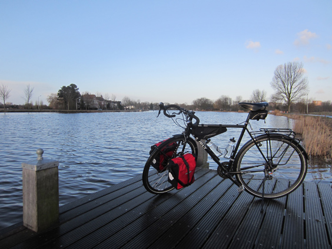
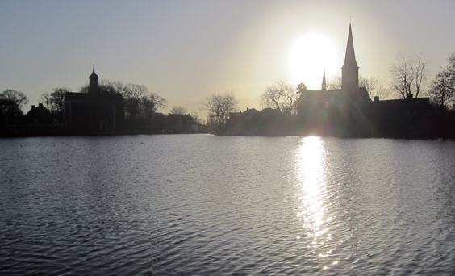
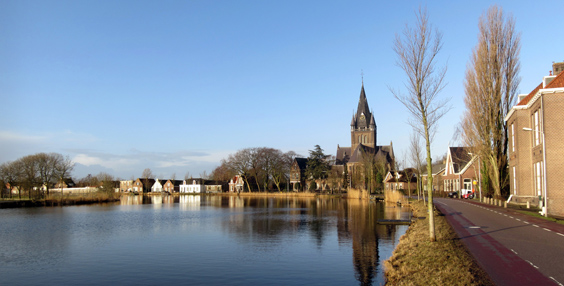
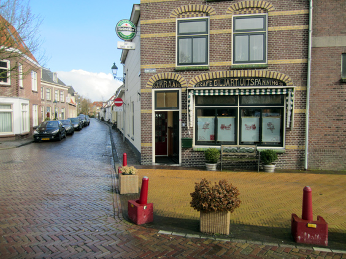
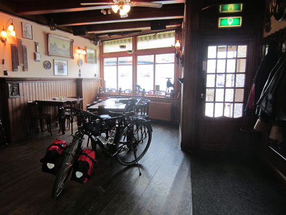

The bike ride I'll talk about today was the first bike ride of 2012. As tradition wants, it was the ride to go to the birthday party of my friend in Rotterdam. I left at 8am in the morning, it was still darkish. Soon I was cycling down the Amstel river, the light was dim and the air was crisp.

The first town I reached is Ouderkerk: it was cold but clear and the sun was on the rise. A gorgeous day!

Around 9:15am I reached Nes aan de Amstel, a few kilometers further. It really was  The following picture is framed and hung in my house.

After Uithoorn, a few wrong choices and some road-blocks took me off the right course. I ended up in Oudewater, a sleepy town preceded by a fantastic windy road along a canal. The wind was quite strong and I got there pretty exhausted. I had a couple of sandwiches so I stopped to devour one, on that little bench in front of a café.

After lunch I went in and sat for a coffee. I didn't know that it would turn out to be the funniest bit of the journey. I ordered a cappuccino; the aged lady promptly brought me an espresso and a creamer cup. "That's how we do it here", she explained with a big smile.
It was as early as noon, but a couple of old friends were already drinking beer and laughing their Sunday away. Next to them, and old farmer with impressive gnarled hands. They started to chat to me in Dutch and to awake in growing interest as I answered through: "You cycled from Amsterdam?? You are Italian?? You come from Rome?? What does AS in front of 'AS Roma' mean??"

(They really asked the last one.)

At some point, I looked outside through the window and I almost got a heart attack: my bike was gone. Oh my God!!
No panic: the bar lady had seen the rain starting to fall and she'd gone outside to pick my bike and take it inside.

Sometimes the most unexpected places hold the most unexpected surprises.
After asking some final directions I took on my bike again, destination Gouda. I've already blogged so much about it. As I cycled, it started snowing, making my last 13 kilometers long and cold, but still warm from the little entr'acte of earlier.
A few hours later I was eating home-made hamburgers at my friends' place. At night, another friend took me and my bike back to Rotterdam in his car. As history wants it, such a great ride couldn't be anything but a good omen for the coming cycling year!
