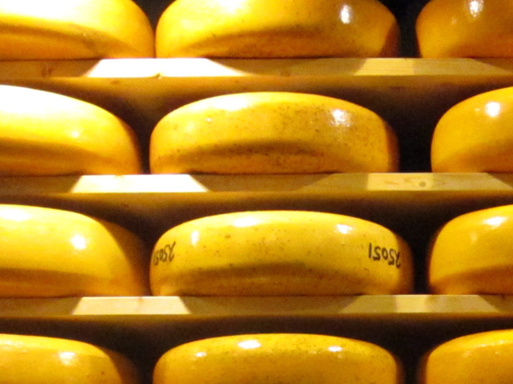
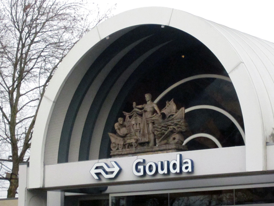
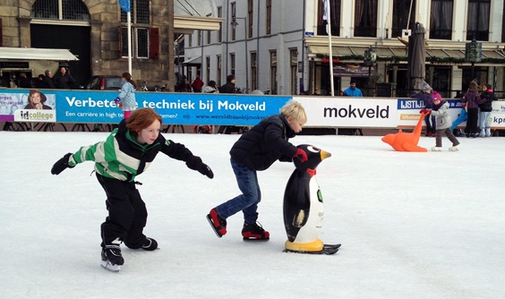
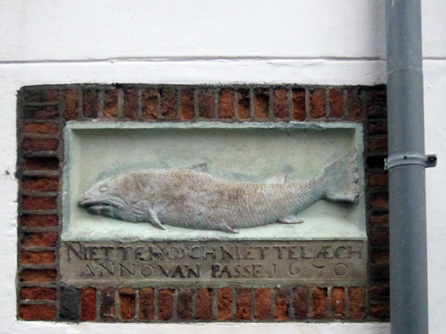
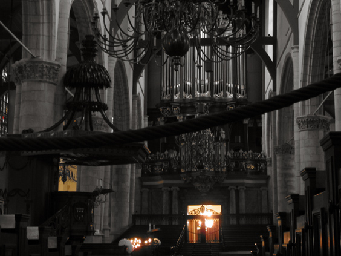
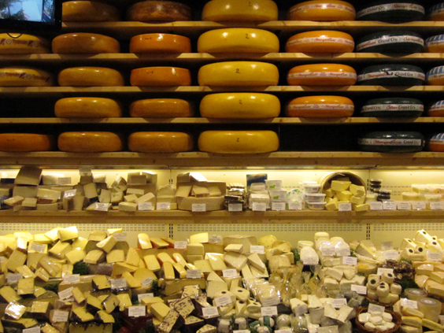

Cheese is one of the legal things that Holland is known for. The round, yellow, tasty cheese that everyone knows and that one imagines fired off ancient ship cannons instead of metal balls.

Gouda is the Dutch town that competes with a couple others for the primacy of cheese. Our expectations upon visiting it didn't span much further that, but it admittedly surprised us with a few little unexpected jewels, and our time in Gouda was chilly yet super nice. Read on to find why.

The very first nice thing about Gouda: the train station entrance is adorned with a statue that summarizes everything that happened here three centuries ago: cheese wheels were collected, weighted and traded by see.

A short walk will take you to the main square, one of the largest in the Netherlands. At the time we went, the main source of noise was a large ice skating rink. Quite usual in cold Netherlands, but for the first time I've seen kids pushing around various plastic shapes, probably as a learning tool. The prize for the best one goes out to a deeply unexpressive penguin.

The same square hosts a special building: the oldest inn of the country, no less! Or, at least, that's what they claim to be. Its name is quite evocative: _de Oude Zalm_ as in _The Old Salmon_. The façade is nothing extraordinary, but one of its wall hides a funny story. A salmon appears as a bas-relief, with the Dutch phrase _"Niet te hooch, niet te laach - van passe"_. It means "Not too high, not too low: just the right height" and it refers to the story when the hotel was forced to adjust the ceiling between the ground and the first floor.

And yet another pleasant surprise: the city's cathedral. A massive church which displays amazing stained glasses for the windows, which in turn have an importanty history: during Second World War, they were all taken off and hidden in a moltitude of farms in the surroundings to prevent contact with the Nazi's greedy hands. We weren't able to take nice pictures of them, but here's a nice view of the church inside.

Only at the end we found what we were looking for: a mountain of cheese. A shop that lets you taste about twenty different varieties of the diary gold, so you can choose your favourite from intriguing ones such as wasabi, sambal or truffel cheese just to name a few.

To sum up, Gouda is lovely beyond its cheesy reputation. If visited with low expectations like we did, it's even better. So don't read this post before going.

_This post was made possible by the generosity of Quickbed: hotels_