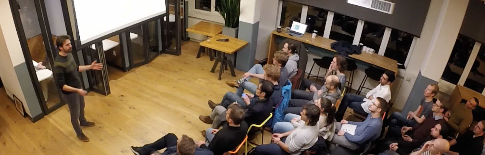

#### UPCOMING 2020

* *Remote*, **Software Circus Conference**, 21st May, "From Zero To Deep Learning"
* *Remote*, **DeveloperWeek Global**, 15th June, "From Zero To Deep Learning With Scala"
* Porto (PT), **Scala Swarm** - 20th June, "From Zero To Deep Learning With Scala"

#### 2020

* *Remote*, **Scalar Online** - 15th May, "From Zero To Deep Learning With Scala"
* *Remote*, **ScalaLove** - 18th April, "From Zero To Deep Learning With Scala" ([slides](https://www.slideshare.net/FabioTiriticco/from-zero-to-deep-learning-with-scala-232229345))
* *Remote*, **ScalaUA** - 3rd April, "From Zero To Deep Learning With Scala" ([recording](https://www.youtube.com/watch?v=HvjaAzW8TAE))
* Amsterdam (NL), **Software Circus Meetup** - 23rd January, "Tame Crypto Events with Streaming"

#### 2019

* London (UK), **London Scala Community Day** - 14th December, "Tame Crypto Events with Streaming"
* ~~London (UK), **Scala eXchange** - 12th December, "Tame Crypto Events with Streaming"~~ *Canceled due to SkillsMatters bankrupcy*
* Ljubljana (SI), **BeeScala** - 21st November, "Tame Crypto Events with Streaming" ([recording](https://www.youtube.com/watch?v=wk8g83XRUzQ))
* Lyon (FR), **Scala IO** - 30th October, "Tame Crypto Events with Streaming"
* Amsterdam (NL), **Women in Tech Regatta** - 1st November, Panel moderator for "Staying Strong in Tech"
* Antwerp (BE), **Belgian Scala User Group** - 7th November, "Tame Crypto Events with Streaming"
* Milan (IT), **Italian Community Managers Summit** - 15th November, "Ten frustrations from the community trenches - and how to deal with them" ([recording](https://www.youtube.com/watch?v=_WqodKHwPk4))
* Amsterdam (NL), **University of Amsterdam** - 15th October, "Tame Crypto Events with Streaming"
* Krakow (PL), **React Sphere** - 9th October, "Tame Crypto Events with Streaming" ([recording](https://www.youtube.com/watch?v=P1W1CSnZdS4))
* Lisbon (PT), **Lx Scala & Reactive** - 4th July, "Reactive From Code to Cloud"
* Amsterdam (NL), **Dutch Cloud Native meetup** - 11th April, "Reactive from Code to Cloud"
* Rome (IT), **Codemotion Rome** - 22nd March, "Akka Cluster vs Kubernetes: Clustering Solutions Showdown"
* Milan (IT), **Scala Milano meetup** - 5th February, "We all need friends, and Akka just found Kubernetes" ([recording 🇮🇹](https://www.youtube.com/watch?v=NTpHZLj3LjI&feature=youtu.be), [slides](https://www.slideshare.net/FabioTiriticco/we-all-need-friends-and-akka-just-found-kubernetes))
* **⭐ Webinar with Lightbend ⭐️** - 24th January, "Akka and Kubernetes: Reactive from Code to Cloud" ([recording](https://www.youtube.com/watch?v=FyneQrH-0Rc), [slides](https://www.lightbend.com/blog/akka-and-kubernetes-reactive-from-code-to-cloud))

#### 2018

* Amsterdam (NL), **KeenFolk meetup** - 6th December, "Stream Thinking with Akka" hands-on workshop
* Amsterdam (NL), **DevJam meetup** - 28th November, "Akka Cluster vs Kubernetes: Clustering Solutions Showdown"
* Amsterdam (NL), **Google GDG CloudFest** - 24th November, "Akka Cluster vs Kubernetes: Clustering Solutions Showdown"
* Berlin (DE), **Codemotion Berlin** - 20th November, "Akka Cluster vs Kubernetes: Clustering Solutions Showdown" ([recording](https://youtu.be/1ICRGG_g5yQ))
* Amsterdam (NL), **ITNEXT** - 14th November, "Akka Cluster vs Kubernetes: Clustering Solutions Showdown" ([recording](https://www.youtube.com/watch?v=v2j2SyVhzTY&t=1s))
* London (UK), **O'Reilly Software Architecture Conference** - 29th October, "Akka Cluster vs Kubernetes: Clustering Solutions Showdown"
* Montreal (CA), **Reactive Summit** - 22nd October, "Akka Cluster vs Kubernetes: Clustering Solutions Showdown" ([recording](https://t.co/f0b2mG6SeY))
* Florence (IT), **Scala Italy** - 14th September, "Cloud Native Akka & Kubernetes: The Holy Grail to Elasticity?" ([recording](https://vimeo.com/294735363))
* Amsterdam (NL), **Software Circus meetup** - 21st August, "Akka Cluster vs Kubernetes: Clustering Solutions Showdown"
* Malaga (ES), **J On The Beach** - 25th May, "Cloud Native Akka & Kubernetes: The Holy Grail to Elasticity?" ([recording](https://youtu.be/OOXRgd5yUQo), [interview](https://youtu.be/pZgrAnORNAU))
* Amsterdam (NL), **Codemotion Amsterdam** - 8th May, Community Leaders Panel Session
* Krakow (PL), **React Sphere** - 17th April, "Cloud Native Akka & Kubernetes: The Holy Grail to Elasticity?"
* Amsterdam (NL), **Reactive Amsterdam meetup** - 9th April, "Cloud Native Akka & Kubernetes: The Holy Grail to Elasticity?" ([recording](https://youtu.be/M8P3MFmMDk4))

#### 2017

* Amsterdam (NL), **Reactive Amsterdam meetup** - 26th October, "Reactive Summit 2017 Hightlights" ([recording](https://youtu.be/J1mkMYIO9gg))
* The Hague (NL), **Dev/070 meetup** - 25th October, "Reactive Programming or Reactive Systems? (spoiler: both)"
* Utrecht (NL), **DomCode meetup** - 26th September, "Reactive Programming or Reactive Systems? (spoiler: both)"
* Amsterdam (NL), **Codemotion Amsterdam** - 16th May, "Beyond Fault Tolerance" ([recording](https://youtu.be/zgKoAfhCHVE))
* Amsterdam (NL), **Reactive Amsterdam meetup** - 11th April, "The World is a Streaming Place - Akka Streams at Weeronline" ([intro](https://youtu.be/eKkeHHTSETw), [recording](https://youtu.be/MQGXrrhGUTw))
* **Codemotion Webinar** - 7th February, "How Reactive Can You Be?"

#### 2016

* Hilversum (NL), **Dutch Android User Group** - 23rd August, "Reactive in Android and Beyond Rx"
* Amsterdam (NL), **Codemotion Amsterdam** - 11th May, "Reactive Android: RxJava and beyond" ([recording](https://youtu.be/QGYzrEZEW_k))

#### 2015

* Amsterdam (NL), **Reactive Amsterdam meetup** - 13th November, "Reactive Earthquakes"

#### 2014

* Amsterdam (NL), **Amsterdam Scala meetup** - 20th March, "WebSockets with Scala and Play Framework"



